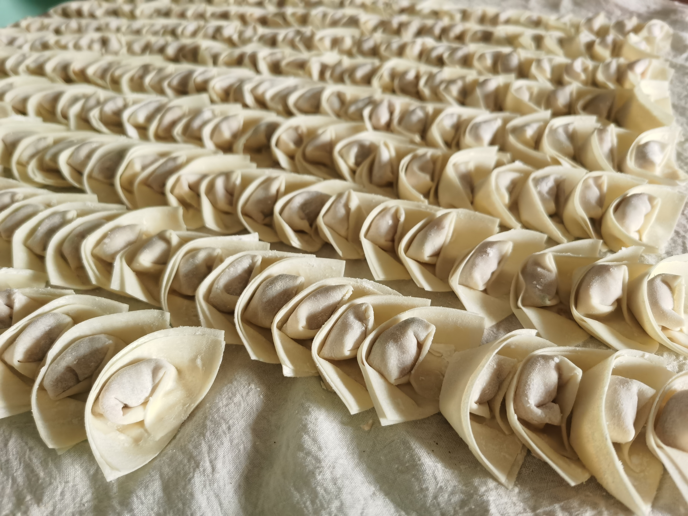
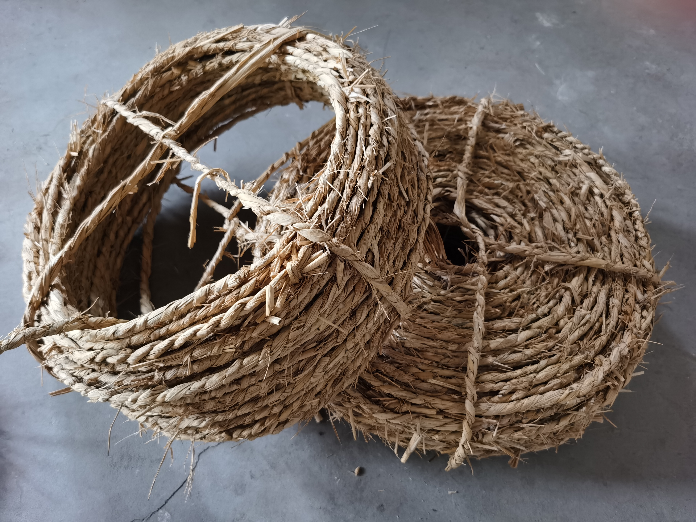

今天起床发现停电了，起因是村上一条电路线维修。昨天临时停电的通知老爸收到后忘记和我们转达，所以我「猝不及防」的停电生活就此开始咯。

# 停电生活小记

起床先洗漱，因为停电不久，碰了碰运气，热水器还残留些热水，「侥幸」舒舒服服地刷了牙搓了把脸。家里的自来水温度低，或许是农村自来水源的关系，冬天用自来水刷牙并不是愉快的体验。

由于停电，爸妈的工作也摁下了暂停键。老爸上房修补屋顶，北边的车间年头长，底下的瓦片碎掉后下雨天会漏水。我也上屋顶去，抛完整的瓦片给老爸。这是一个技术活，平面上抛接物体是等物体下降到原平面高度时接住，而屋顶是斜面，要在抛物线的顶点附近接物体。刚开始我低估了所需的力量，瓦片抛得近摔碎三张，被老爸嘲笑了一翻。老妈包起了馄饨，说等我工作租房后，周末可以来家里带些馄饨回去，放小冰箱里，煮着吃很方便。

老妈包的馄饨

奶奶喊我帮忙摇给蚕结茧的[蜈蚣簇](https://baijiahao.baidu.com/s?id=1616007934689032491)，原材料是水稻秸秆。我和姐姐劝过好多年，让她不要再养蚕，年纪大身体最重要，但这是奶奶的事业，她不肯放弃。桐乡蚕丝被是这边的特产，农村人家会屯着几十斤的 ~~蚕丝~~ 丝绵[^simian]，大多用作嫁妆。我在学校盖一条四斤的蚕丝被，裸睡很舒服。

[^simian]: 老妈纠正：是丝绵，不是蚕丝。蚕茧剥开拉成棉兜后晒干为丝绵，丝绵拉开后叠起来就是蚕丝被了。

草绳

农村人家有柴火灶和煤气灶，停电也不会饿肚子。当我想用微波炉加热凉掉的菜，而后才想起已停电时，心里咯噔一下，这是今天停电以来第一次受到约束。由此我突发奇想，想到了一种对日常生活中电器的分类方法：「带缓存」和「不带缓存」。

「不带缓存」就比如微波炉、电脑显示器，这类电器只要离开电源就失去功能，就「有用性」来说，它们变成了一堆破烂。「带缓存」除去客观上带电池的，比如手机、笔记本电脑，还有离开电源后可以将功能（略有打折地）保留一段时间的电器，比如冰箱、热水器。在平常有电的大部分生活里，我们并不会感觉到「带缓存」的重要性，当停电或其他意外情况发生时，可以明显发现「带缓存」的电器给我们带来缓冲，或者说安全感。

我可以用还剩 15% 电量的手机告诉小王我即将下线。得益于「本地优先」的储存策略，我可以在笔记本电脑上看一些学习资料、写写博客；或用 Kindle 看看书，最近在学习「如何写作」，看 AF[^code] 推荐的《写作是门手艺》。

[^code]: 身边人称呼的博客匿名写法，将在博客中一直使用。

# 一些想到

除去寝室欠费被拉闸，长大后遇到停电的情况少了。小时候经常停电，夏天开空调的人家一多，通常就是区域性的停电。夏天的夜晚，几户人家从房间出来，躺在各自的阳台，听稻田里的蛙声，对着洁白的月光说上几句家常，还能收到回应。几阵凉风吹过，便是一个好觉。

写到此，房间灯亮了，「不带缓存」的电器重新归位。我又想到过年期间和几位朋友聊天，谈到「电车还是油车」的问题，特斯拉车主朋友力荐特斯拉，而我和几位男性朋友仍偏好油车，在我们看来，油车的「缓存」能力更强，和时刻关注电量比起来，加满油后的「放肆」更令我们心动。我认为电车更符合拥有独栋建筑的个人，让给车充电变得和给手机充电一样自然，省去时刻记挂的心事。这里大部分是「鸽子笼」，我更爱我土生土长的农村小家了。
