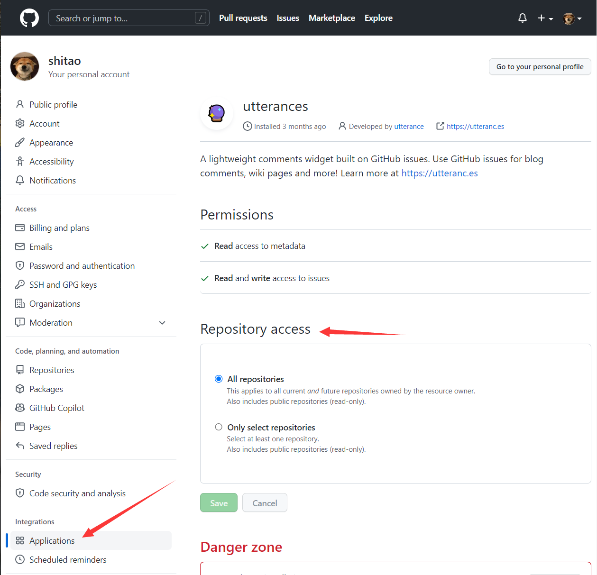
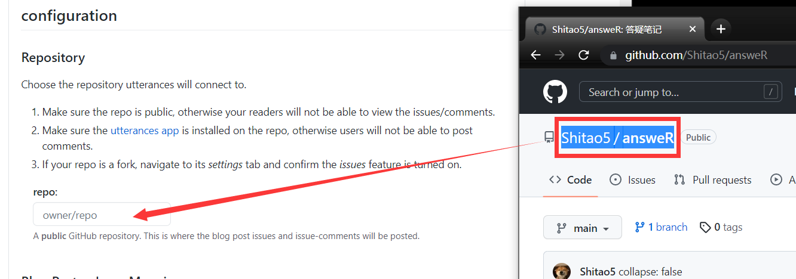
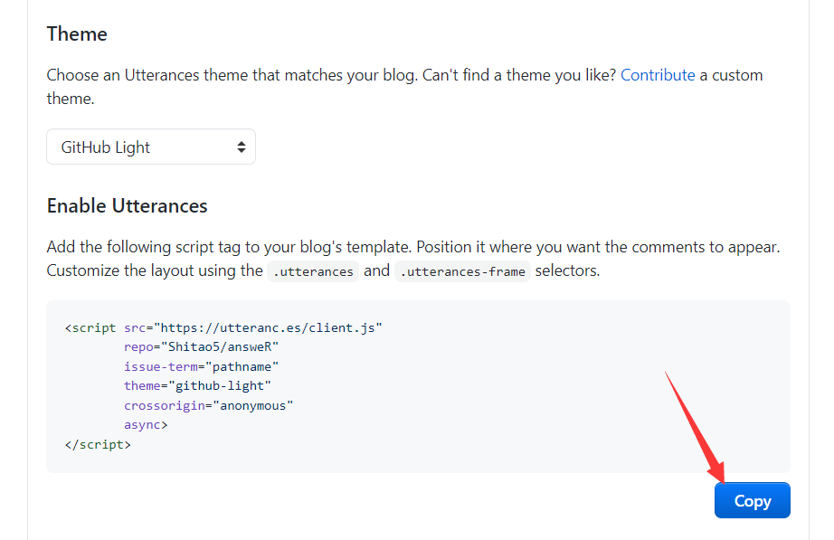
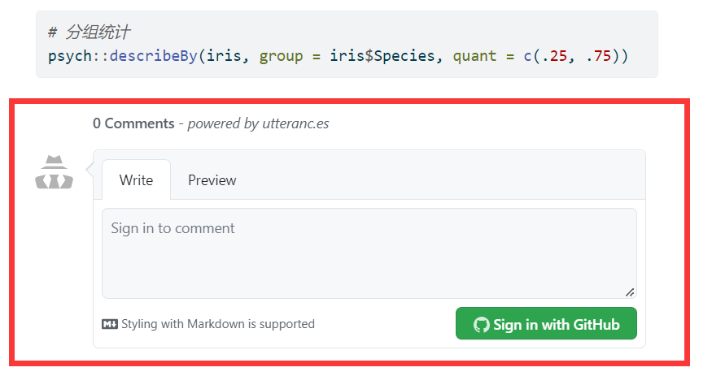

最近在 [Quarto 文档的 HTML 部分](https://quarto.org/docs/output-formats/html-basics.html#commenting)看到了 Quarto HTML 输出支持 [utterances](https://utteranc.es/) 评论，特地用自己的[一个 Quarto 项目](https://shitao5.github.io/answeR/)试了一下，可行，过程记录在此。

根据 utterances 配置要求：

1. 该 git 仓库需是公开的；
1. utterances 应安装在版本库上：安装页面[在此](https://github.com/apps/utterances)。

# 设置 utterances 访问权限

首先，应确保 utterances 对仓库具有访问权限。在 `github -> setting -> Applications` 页面进行设置。俺直接设置了 utterances 可以访问我的所有仓库。



# 配置 utterances

## 设置 utterances 评论

在 <https://utteranc.es/> 中，填写`仓库所有者/仓库名`:



而后选择页面和 GitHub issues 之间的映射，这个对于博客和书籍有用些（我一般保持默认）。对于单个页面，所有的评论都会放在一个 issue 下。

其他功能也可以根据个人需求选择。

## 在 .qmd 文件中嵌入评论



复制该页面生成的代码片段，粘贴到 .qmd 文件最后：

```html
<script src="https://utteranc.es/client.js"
        repo="Shitao5/answeR"
        issue-term="pathname"
        theme="github-light"
        crossorigin="anonymous"
        async>
</script>
```

<!--

墙内不支持 gist，直接用 md 吧。
-->

## 可以啦！

快让小伙伴们来评论吧！


