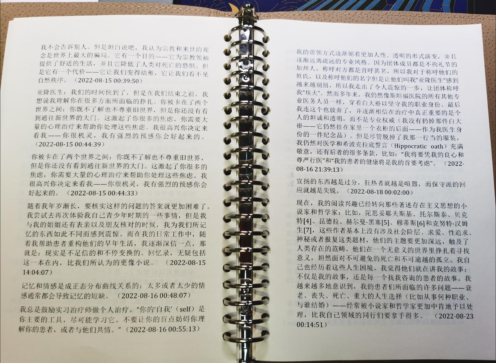
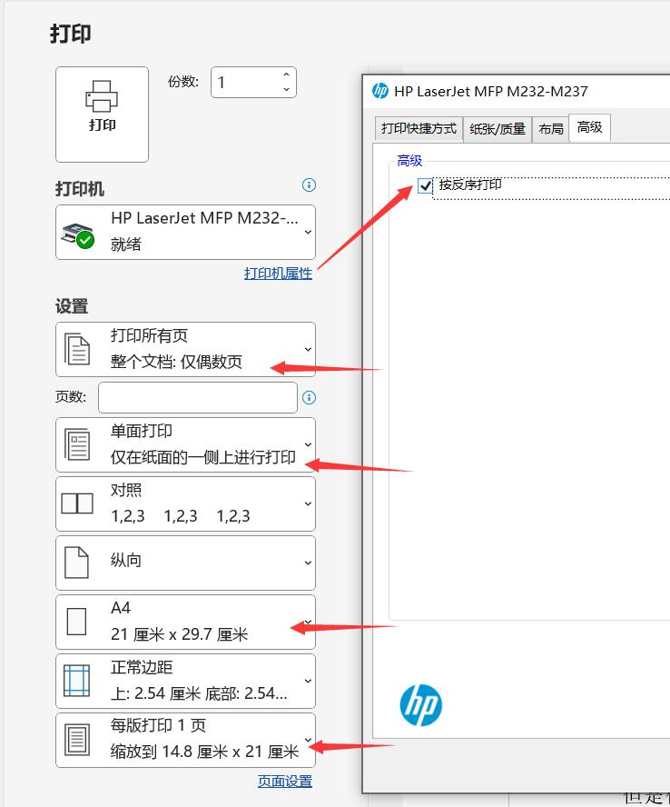
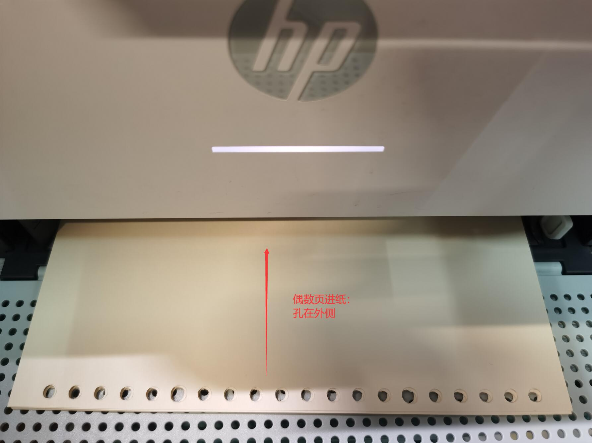
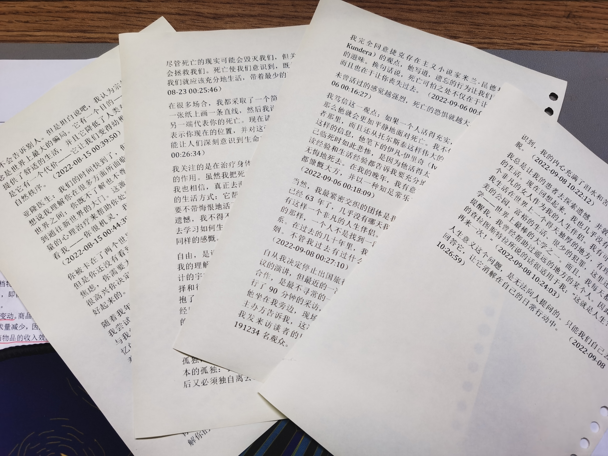
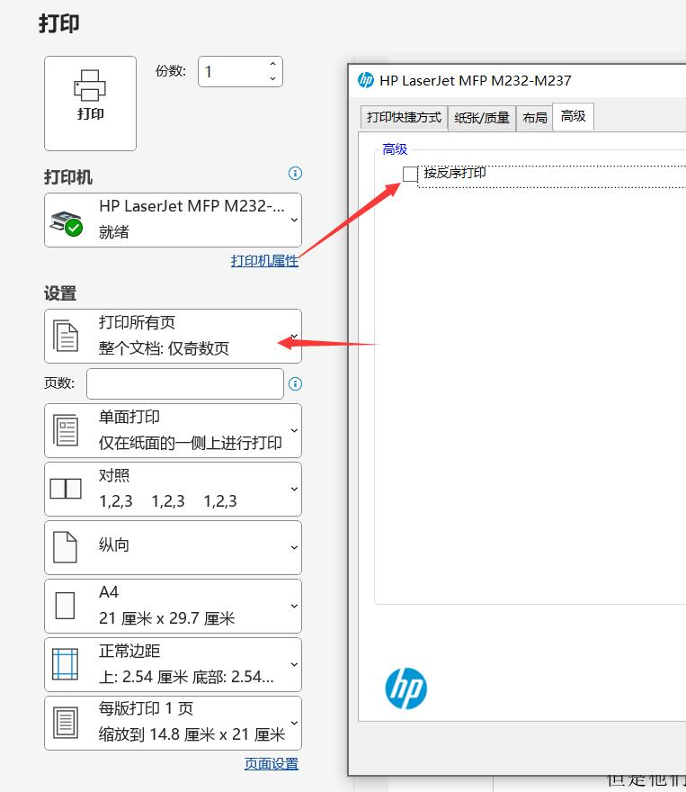
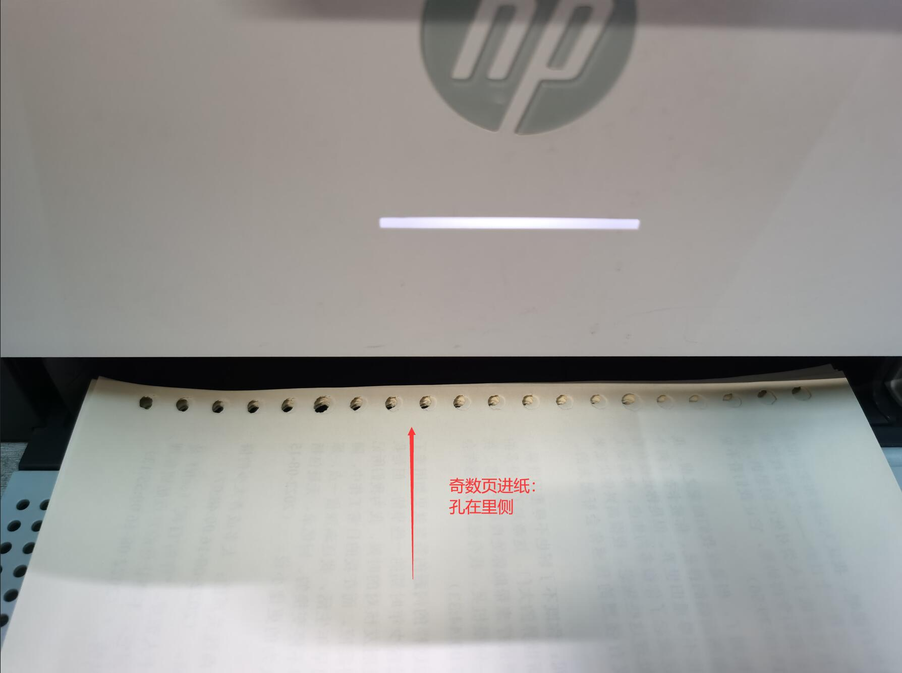
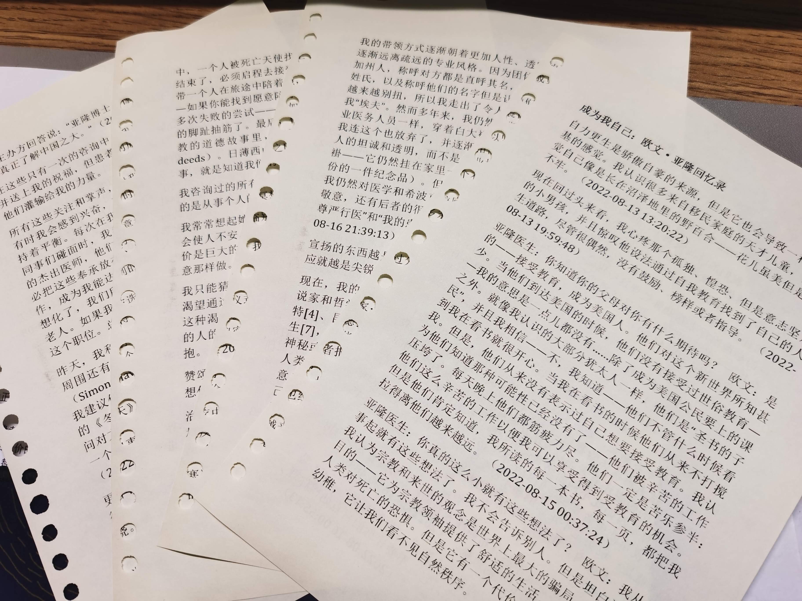

明早有个比较正式的宣讲，被叫去听咯，还要带上小本本和笔做记录，吓得我都不敢带 Kindle。后来想到可以把想看的一些内容[^todo]打印在小本本上，如图：

Figure 1: 双面打印的 A5 活页小本本

第一次用自己的[打印机](https://item.jd.com/100019179990.html)双面打 A5 的活页纸[^a4]，打印活页本需要考虑到孔和奇偶数页的位置关系，每一页都有对应该打印的位置。摸索了一下打印流程，记录在此。

[^todo]: 把搁置的读书笔记看一看。

[^a4]: 打印 A4 的时候可以自动双面，不知道为啥 A5 不行，那就手动双面好啦！

# 打印步骤

## 偶数页逆序打印

Figure 2: 偶数页逆序打印设置及纸张放置

### Word 打印设置

1. 打印奇数页；
1. 单面打印、逆序；
1. 纸张设置为 **A4** （注意，不是 A5 且一定要为 A4 。这里的纸张就是 `布局-纸张` 里的纸张，一般用的都是 A4。如果不是 A4，不能启用 A5 的打印[^a5]）；
1. 缩放到 A5。

[^a5]: 这算是 Word 奇奇怪怪的毛病吧！

### 纸张放置

1. 活页纸的孔在外放入进纸盒。

### 偶数页逆序打印效果

打印完偶数页之后是这样的：

Figure 3: 偶数页逆序打印效果

1. 在文档中位置越靠后的页面，打印出来的纸张在越前面。

1. 偶数页的内容在孔的左侧。

## 奇数页正序打印

Figure 4: 奇数页正序打印设置及纸张放置

### Word 打印设置

在偶数页逆序打印的基础上修改：

1. 打印偶数页；
1. 单面打印、正序。

### 纸张放置

1. 活页纸的孔在里放入进纸盒。

### 奇数页正序打印效果

打印完奇数页之后是这样的：

Figure 5: 奇数页正序打印效果

1. 奇数页的内容在孔的右侧。

1. 打印后的顺序和文档顺序一致。

# 总结

因为俺的打印机打印好的那一面是朝下的，所以要先逆序打印偶数页，再正序打印奇数页，这样最后打完的时候顺序才是对的，不需要手动去调整页面顺序。

之前还用过一台爱普生的喷墨打印机，具体型号记不得了，它打印完的页面是朝上的，所以双面打印是正序奇数页和正序偶数页就可以了。

写完了，吐槽一句，原装耗材真贵。
