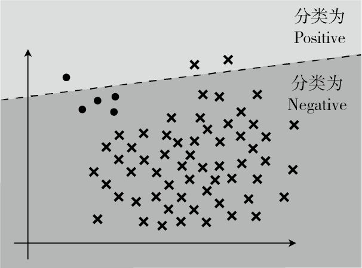
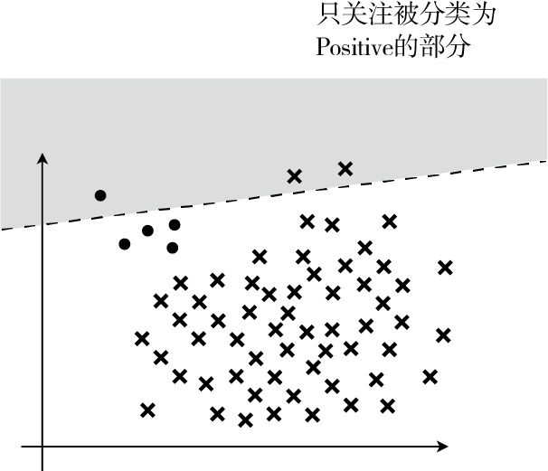
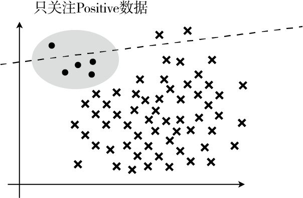
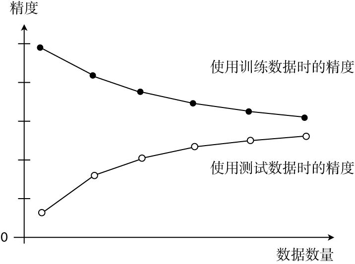

# 简介

花了一周左右的时间看完了这本小册子，作者以两位女孩子对话的形式讲解机器学习中使用到的数学基础知识。作者使用「基于广告费预测点击量」的案例讲解「回归」，使用「基于图像大小进行分类」的案例讲解「分类」，再讲如何评估已建立的模型，最后是「使用 Python 编程实现」（感觉有点过时，没看）。

好在去年底<a class="link" href="../choice/#备考时光">备战考研</a>时候主要学了数学，读的时候才不觉生涩难懂，当然肯定离不开作者深入浅出的讲解。

# 知识点梳理

无论是过去还是现在，计算机都特别擅长处理重复的任务。计算机能够比人类更高效地读取大量的数据、学习数据的特征并从中找出数据的模式。这样的任务也被称为**机器学习**或者**模式识别**，以前人们就有用计算机处理这种任务的想法，并为此进行了大量的研究，也开发了很多代码。了解机器学习适合的应用场景，明确它能做什么、不能做什么也很重要。 

当我们打算用机器学习做什么事情的时候，首先需要的就是数据。因为机器学习就是从数据中找出特征和模式的技术。实际上机器学习中最麻烦的地方，就是收集数据。无论收集数据的环境变得多好，还是有很多需要人工介入的工作。

使用有标签的数据进行的学习称为有监督学习，与之相反，使用没有标签的数据进行的学习称为无监督学习。回归和分类是有监督学习，聚类是无监督学习。

## 梯度下降法

微分是计算变化的快慢程度时使用的方法。只要向与导数的符号相反的方向移动 $x$，$g(x)$ 就会自然而然地沿着最小值的方向前进。参数会自动更新，表达式：

$$x := x - \eta \frac{\text{d}}{\text{d}x}g(x) \tag{1}$$

这也被称为**最速下降法**或**梯度下降法**。

`A := B` 这种写法，它的意思是通过 B 来定义 A。拿表达式（1）来说就是用上一个 $x$ 来定义新的 $x$。
$\eta$ 是称为学习率的正的常数，读作「伊塔」。根据学习率的大小，到达最小值的更新次数也会发生变化。换种说法就是收敛速度会不同。有时候甚至会出现完全无法收敛，一直发散的情况。 

如果 $\eta$ 较大，那么 $x := x - \eta (2x-2)$ 会在两个值上跳来跳去，甚至有可能远离最小值。这就是发散状态。而当 $\eta$ 较小时，移动量也变小，更新次数就会增加，但是值确实是会朝着收敛的方向而去。

最速下降法的缺点是计算量大、计算时间长，容易陷入局部最优解。

## 随机梯度下降法

最速下降法更新 1 次参数的时间，随机梯度下降法可以更新 $n$ 次。此外，随机梯度下降法由于训练数据是随机选择的，更新参数时使用的又是选择数据时的梯度，所以不容易陷入目标函数的局部最优解。 

不管是随机梯度下降法还是小批量梯度下降法，我们都必须考虑学习率 $\eta$ 。把 $\eta$ 设置为合适的值是很重要的。

## 感知机

感知机是接受多个输入后将每个值与各自的权重相乘，最后输出总和的模型。感知机是非常简单的模型，基本不会应用在实际的问题中，它是神经网络和深度学习的基础模型。既然有单层感知机，那么就会有多层感知机。实际上多层感知机就是神经网络了。

## 分类

在回归中要考虑的是答案不完全一致时的误差，而分类中要考虑的是答案是否正确。分类结果为正的情况是 Positive、为负的情况是 Negative。分类成功为 True、分类失败为 False。

**精度：** $Accuracy = \frac{TP + TN}{TP + FP + FN + TN}$，表示在整个数据集中，被正确分类的数据 TP 和 TN 所占的比例。

**精确率：** $Precision = \frac{TP}{TP + FP}$，表示在被分类为 Positive 的数据中，实际是 Positive 的数据所占的比例。

**召回率：** $Recall = \frac{TP}{TP + FN}$，表示在 Positive 数据中，实际被分类为 Positive 的数据所占的比例。

一般来说，精确率和召回率会一个高一个低，需要我们取舍。综合评定性能的指标 $F$ 值，表达式为：

$$Fmeasure = \frac{2}{\frac{1}{Precision} + \frac{1}{Recall}} = \frac{2 \cdot Precision \cdot Recal}{Precision + Recall} \tag{2}$$

精确率和召回率只要有一个低，就会拉低 $F$ 值。

当数据不平衡时，使用数量少的那个会更好。最开始的例子中 Positive 极少，所以我们使用了 Positive
来计算，反之如果 Negative 较少，那就使用 Negative。 

## 交叉验证

把全部训练数据分为测试数据和训练数据的做法称为**交叉验证**。交叉验证的方法中，尤为有名的是 $K$  折交叉验证：

1. 把全部训练数据分为 $K$ 份；
2. 将 $K-1$ 份数据用作训练数据，剩下的 1 份用作测试数据；
3. 每次更换训练数据和测试数据，重复进行$K$ 次交叉验证；
4. 最后计算 $K$ 个精度的平均值，把它作为最终的精度。

不切实际地增加 $K$ 值会非常耗费时间，所以我们必须要确定一个合适的 $K$ 值。

## 过拟合

有几种方法可以避免过拟合：

1. 增加全部训练数据的数量
2. 使用简单的模型
3. 正则化  

首先，重要的是增加全部训练数据的数量。机器学习是从数据中学习的，所以数据最重要。另外，使用更简单的模型也有助于防止过拟合。

正则化可以防止参数变得过大，有助于参数接近较小的值，通过减小不需要的参数的影响，将复杂模型替换为简单模型来防止过拟合。 

$\theta_{0}$ 这种只有参数的项称为**偏置项**，一般不对它进行正则化。 $\lambda$ 是决定正则化项影响程度的正的常数。这个值需要我们自己来定。

对数似然函数本来以最大化为目标。想让它变成和回归的目标函数一样的最小化问题，所以加了负号。这样就可以像处理回归一样处理它，所以只要加上正则化项就可以了。反转符号是为了将最大化问题替换为最小化问题呀。反转了符号之后，在更新参数时就要像回归一样，与微分的函数的符号反方向移动才行。目标函数的形式变了，参数更新的表达式也会变，只要再把正则化项的部分也微分了就行，一点都不难。 

正则化的方法不止一个。L1 正则化的特征是被判定为不需要的参数会变为 0，从而减少变量个数。而 L2 正则化不会把参数变为 0。以二次式变为一次式的例子吧，用 L1 正则化就真的可以实现了。L2 正则化会抑制参数，使变量的影响不会过大，而 L1 会直接去除不要的变量。 

## 学习曲线

如果模型过于简单，那么随着数据量的增加，误差也会一点点变大。换句话说就是精度会一点点下降。 

将两份数据的精度用图来展示后，如果是这种形状，就说明出现了欠拟合的状态。也有一种说法叫作高偏差，指的是一回事。

像这样展示了数据数量和精度的图称为学习曲线。通过学习曲线判断出是过拟合还是欠拟合之后，就可以采取相应的对策以便改进模型了。

在参数更新之前，最好把训练数据变成平均值为 0、方差为 1 的数据。这个预处理不是必须的，但是做了之后，参数的收敛会更快，这种做法也被称为标准化或者 z-score 规范化。

