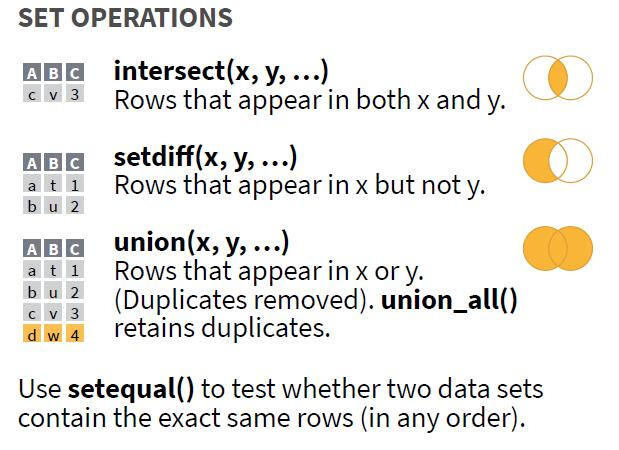

# 集合运算

在学习《概率论与数理统计》的时候运用集合运算较多，在实际数据处理的场景中，集合运算也非常实用。目前 **dplyr** 支持集合的交、并、补运算，可以从[速查表](https://github.com/rstudio/cheatsheets/blob/main/data-transformation.pdf)中查看：

<center></center>
<center>dplyr 目前支持的集合运算</center>


本文以案例的形式讲解如何将集合运算嵌入到 tidyverse 数据处理中，提高数据处理效率。

# 问题描述

现有一班和二班两个班级，每个班级三名学生，`English` 和 `Math` 列分别是英语考试和数学考试的成绩，现需统计每个班级中两次考试都在排名前二的学生。


```r
library(tidyverse)

df <- tibble(
  class = rep(c("一班", "二班"), each = 3),
  name = LETTERS[1:6],
  English = c(100, 90, 80, 90, 70, 60),
  Math = c(98, 80, 90, 85, 90, 60)
)  # 示例数据

df
#> # A tibble: 6 × 4
#>   class name  English  Math
#>   <chr> <chr>   <dbl> <dbl>
#> 1 一班  A         100    98
#> 2 一班  B          90    80
#> 3 一班  C          80    90
#> 4 二班  D          90    85
#> 5 二班  E          70    90
#> 6 二班  F          60    60
```

根据示例数据，结果应为一班的 A，二班的 D 和 E。

# 问题解决思路

1. 示例数据是一个宽数据，先拉长为整洁数据；
1. 分组，将每个班级每次考试前两名的学生姓名各形成一个集合；
1. 将每个班级两次考试得到的集合取交集，得到结果。

# 问题解决流程

## 拉长为整洁数据

把原始数据拉长为整洁数据后，数据框中每行代表一个班级中的一名学生一门科目的考试成绩：


```r
df %>% 
  pivot_longer(English:Math,
               names_to = "test",
               values_to = "score")
#> # A tibble: 12 × 4
#>    class name  test    score
#>    <chr> <chr> <chr>   <dbl>
#>  1 一班  A     English   100
#>  2 一班  A     Math       98
#>  3 一班  B     English    90
#>  4 一班  B     Math       80
#>  5 一班  C     English    80
#>  6 一班  C     Math       90
#>  7 二班  D     English    90
#>  8 二班  D     Math       85
#>  9 二班  E     English    70
#> 10 二班  E     Math       90
#> 11 二班  F     English    60
#> 12 二班  F     Math       60
```

## 每次考试前两名学生集合

以 `class` 和 `test` 分组提取前两名：


```r
df %>% 
  pivot_longer(English:Math,
               names_to = "test",
               values_to = "score") %>% 
  slice_max(score, n = 2,
            by = c(class, test))
#> # A tibble: 8 × 4
#>   class name  test    score
#>   <chr> <chr> <chr>   <dbl>
#> 1 一班  A     English   100
#> 2 一班  B     English    90
#> 3 一班  A     Math       98
#> 4 一班  C     Math       90
#> 5 二班  D     English    90
#> 6 二班  E     English    70
#> 7 二班  E     Math       90
#> 8 二班  D     Math       85
```

同样是以 `class` 和 `test` 分组，将每个班级每次考试前两名的学生姓名组成集合：


```r
df1 <- df %>% 
  pivot_longer(English:Math,
               names_to = "test",
               values_to = "score") %>% 
  slice_max(score, n = 2,
            by = c(class, test)) %>% 
  group_by(class, test) %>% 
  reframe(name_set = list(name))
df1
#> # A tibble: 4 × 3
#>   class test    name_set 
#>   <chr> <chr>   <list>   
#> 1 一班  English <chr [2]>
#> 2 一班  Math    <chr [2]>
#> 3 二班  English <chr [2]>
#> 4 二班  Math    <chr [2]>
```

`name_set` 是一个列表列，包含了每次考试前两名的姓名，它长这样：


```r
df1$name_set
#> [[1]]
#> [1] "A" "B"
#> 
#> [[2]]
#> [1] "A" "C"
#> 
#> [[3]]
#> [1] "D" "E"
#> 
#> [[4]]
#> [1] "E" "D"
```

从上到下分别是：

1. 一班英语成绩前两名的学生姓名；
1. 一班数学成绩前两名的学生姓名；
1. 二班英语成绩前两名的学生姓名；
1. 二班数学成绩前两名的学生姓名。

## 集合取交集

再次拉宽：


```r
df2 <- df1 %>% 
  pivot_wider(id_cols = class,
              names_from = test,
              values_from = name_set)
df2
#> # A tibble: 2 × 3
#>   class English   Math     
#>   <chr> <list>    <list>   
#> 1 一班  <chr [2]> <chr [2]>
#> 2 二班  <chr [2]> <chr [2]>
```

拉宽后形成的数据框含 3 列，分别是班级列、英语考试中排名前二的学生姓名集合列、数学考试中排名前二的学生姓名集合列[^set]。对每个班级的两次考试前两名集合取交集，即可得到每个班级两次考试都在前两名的学生：


```r
df3 <- df2 %>% 
  mutate(student = map2(English, Math, dplyr::intersect))
df3
#> # A tibble: 2 × 4
#>   class English   Math      student  
#>   <chr> <list>    <list>    <list>   
#> 1 一班  <chr [2]> <chr [2]> <chr [1]>
#> 2 二班  <chr [2]> <chr [2]> <chr [2]>
```


[^set]: 操作列表列时需注意，使用 `map()` 系列函数。

`student` 列也是一个列表列，里面包含了每次考试都排名班级前二的学生姓名：


```r
df3$student
#> [[1]]
#> [1] "A"
#> 
#> [[2]]
#> [1] "D" "E"
```

可以根据需要通过 `unnest()` 系列函数将其展开：

#### 横向展开


```r
df3 %>% 
  select(class, student) %>% 
  unnest_wider(col = student,
               names_sep = "")
#> # A tibble: 2 × 3
#>   class student1 student2
#>   <chr> <chr>    <chr>   
#> 1 一班  A        <NA>    
#> 2 二班  D        E
```

#### 纵向展开


```r
df3 %>% 
  select(class, student) %>% 
  unnest_longer(col = student)
#> # A tibble: 3 × 2
#>   class student
#>   <chr> <chr>  
#> 1 一班  A      
#> 2 二班  D      
#> 3 二班  E
```

# 总结

在数据分析中，集合运算可以用来计算重复数据，计算交集并集等。多多学习，多多运用🎇。
