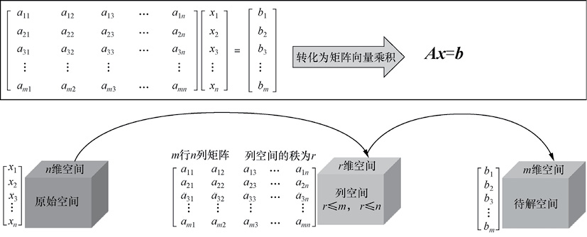
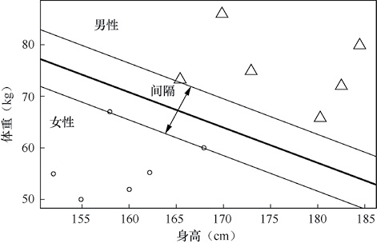

# 简介

这本书主要是在睡觉前和上下班打车的路上看完的，读这本书的目的和[《白话机器学习的数学》](../ml-math)一样，希望对机器学习的框架有系统的了解。相比这下，这本书篇幅更大，内容更详细。最吸引我的地方是作者试图突破国内教材在微积分、线性代数和概率论这些课程上生涩的公式，先从「形而上」的角度阐述这些公式在做什么，而后对细节娓娓道来，让读者「既见森林，又见树木」。

读完，我觉得作者是成功的。

# 知识点梳理

## 第一章 微积分

最简单的函数是一次函数，最简单的方程是一次方程，微积分的基本思想就是将其他复杂的函数或者方程变成一次函数或一次方程来研究。根据近似的精确度不同，微积分可以分为以下几种情况：
1. 第一种情况，用常数项近似代替某个函数在某点附近的数值，这就是极限，误差是无穷小。
2. 第二种情况，用一次函数近似代替某个函数在某点附近的数值，这就是微分，误差为高阶无穷小。
3. 第三种情况，用泰勒公式近似代替某个函数在某点附近的数值，误差比前两种情况都要小。从近似的精确度来看，泰勒公式的极限最低，但精确度是最高的。 （2023-03-01 08:25:22）

梯度和导数是密切相关的一对概念，实际上梯度是导数对多元函数的推广，它是多元函数对各个自变量求偏导形成的向量。 （2023-03-01 23:09:33）

梯度实际上就是多变量微分的一般化，例如。对该函数求解微分，也就得到了梯度。梯度的本意是一个向量，表示某一函数在该点处的方向导数沿着该方向取得最大值，即函数在该点处沿着该方向（此梯度的方向）变化最快，变化率最大（为该梯度的模）。一般来说，梯度可以定义为一个函数的全部偏导数构成的向量。 （2023-03-01 23:16:04）

泰勒公式的主要作用是对特别复杂的函数进行化简，具体来说就是通过近似函数来代替原函数，通过使用简单熟悉的多项式去代替复杂的原函数。 （2023-03-01 23:22:38）

## 第二章 线性代数

线性代数主要研究线性空间中对象的运动规律。这里面有两个核心问题，一个是**线性空间中的对象**，另一个是**线性空间中对象的运动规律**。这其实也就引出了向量和矩阵的概念。  
线性空间中的对象称为**向量**，通常是选定一组线性无关的基向量，通过基向量的线性组合来表示。而线性空间中的运动被称为**线性变换**，描述了线性空间中的对象也就是向量是如何运动的。这种线性变换是通过**矩阵**的形式来描述的。  
线性空间中使得某个对象（向量）发生某种运动（线性变换）的方法，就是**用描述对应运动的矩阵去乘以表示对应对象的向量**。也就是说，确定了线性空间中的一组线性无关的基向量后，线性空间中的任一对象都可以用向量来刻画，对象的运动则由矩阵乘以向量来表达。而描述运动（线性变换）的矩阵自身又可以看作线性空间基向量被施加了同一线性变换，这使得一切变得和谐而统一。 （2023-03-03 07:51:44）

### 直观理解向量

虽然向量既可以写成行向量（一行数组），也可以写成列向量（一列数组），但如果没有特别说明，一般说的向量都指**列向量**。向量虽然形式上只是一列数，但由于数组具有有序性，因此除了数组中的数值本身携带信息外，这些数值的序列位置仍然携带了部分信息，这就是向量如此有用的一个原因。  
这里我们介绍一下教科书上经常省略的“秘密”，那就是为什么大部分教科书会写明“一般没有指明，默认向量为列向量”。这是因为矩阵乘积的习惯性写法是“**先对象后操作**”，即 $\mathbf{Ax}$，所以要求向量 $\mathbf{x}$ 放置在矩阵 $\mathbf{A}$ 的右边。由于矩阵一般具有 $n$ 列，根据矩阵乘法规则要求向量需具有 $n$ 行，也就是说要求向量 $\mathbf{x}$ 是列向量。因此，为了符合矩阵乘法的标记习惯，我们一般所指的向量默认为列向量。 （2023-03-03 08:04:19）

向量内积的几何定义用来表征向量 $\mathbf{a}$ 在向量 $\mathbf{b}$ 方向上的投影长度乘以向量 $\mathbf{b}$ 的模长，即。如果向量 $\mathbf{b}$ 是单位向量（即模长为1），那么向量 $\mathbf{a}$ 与向量 $\mathbf{b}$ 的内积结果就等于向量 $\mathbf{a}$ 在向量 $\mathbf{b}$ 方向上的投影长度。这就是向量内积的几何定义。 （2023-03-03 08:14:17）

从几何角度考虑，二维空间中向量 $\mathbf{a}$ 和向量 $\mathbf{b}$ 外积的结果可以表达为。它表示向量 $\mathbf{a}$ 和向量 $\mathbf{b}$ 张成的平行四边形的“面积”。如果向量 $\mathbf{a}$ 和向量 $\mathbf{b}$ 的夹角大于180度，那么向量外积的结果为负数。 （2023-03-03 08:14:26）

从几何角度考虑，三维空间中向量 $\mathbf{a}$ 和向量 $\mathbf{b}$ 外积的结果是向量 $\mathbf{a}$ 和向量 $\mathbf{b}$ 张成平面的法向量。三维空间中，向量外积的结果是一个向量，而不是一个标量，并且两个向量的外积与这两个向量组成的坐标平面垂直。 （2023-03-05 22:47:44）

通俗的解释就是，由一组向量的线性组合得到零向量只能通过所有系数为 0 这种方式实现，那么这组向量就是**线性无关**的，反之则是线性相关的。  
一组向量线性相关就是指这些向量中至少有一个向量对于张成最高维度的向量空间是“没有贡献”的（因为它可以由别的向量的线性组合得到）。反过来讲，如果所有的向量都无法通过其他向量线性组合的方式得到，每个向量都给张成的新空间做出了“贡献”，也就是“一个都不能少”，那么就说这些向量是线性无关的。 （2023-03-05 22:50:18）

### 直观理解矩阵

矩阵向量乘法描述的是线性空间中的一种线性变换，原始向量在矩阵所对应的线性变换作用下空间位置甚至空间维度和形态都发生了改变，这就是**矩阵的空间映射作用**。一个直观的方法就是关注并跟踪线性空间基向量的去向。例如二维空间里面的任何一个向量 $\begin{bmatrix} x \\\ y \end{bmatrix}$ 都可以看作 $x \begin{bmatrix} 1 \\\ 0 \end{bmatrix} + y \begin{bmatrix} 0 \\\ 1 \end{bmatrix}$ ，根据线性变换的定义，我们可以得到线性变换之后的新向量：
$$L \left( \begin{bmatrix} x \\\ y \end{bmatrix}  \right) = x L 
 \left( \begin{bmatrix} 1 \\\ 0 \end{bmatrix} \right) + y L  \left( \begin{bmatrix} 0 \\\ 1 \end{bmatrix} \right)$$
所以矩阵的数值描述了该线性变换导致原始线性空间中基向量变换后的形态。假如某个线性变换使得原始基向量 $\begin{bmatrix} 1 \\\ 0 \end{bmatrix}$ 和 $\begin{bmatrix} 0 \\\ 1 \end{bmatrix}$ 变换为新的基向量 $\begin{bmatrix} a \\\ c \end{bmatrix}$ 和 $\begin{bmatrix} b \\\ d \end{bmatrix}$ ，那么原来的任一向量 $\begin{bmatrix} x \\\ y \end{bmatrix}$ 就会变换为目标向量 $x \begin{bmatrix} a \\\ c \end{bmatrix} + y \begin{bmatrix} b \\\ d \end{bmatrix}$ 。如果将变换后基向量 $\begin{bmatrix} a \\\ c \end{bmatrix}$ 和 $\begin{bmatrix} b \\\ d \end{bmatrix}$ 的坐标放在一个 2×2 的格子里，得到一个 2×2 的矩阵 $\begin{bmatrix} a & b \\\  c & d \end{bmatrix}$，这个矩阵就描述了这个线性变换，其中矩阵的每一列就表示线性变换之后的基向量的去向。  
实际上从上面的过程我们很容易理解矩阵向量乘法的规则，如 $\begin{bmatrix} a & b \\\  c & d \end{bmatrix}  \begin{bmatrix} x \\\ y \end{bmatrix} = x \begin{bmatrix} a \\\ c \end{bmatrix} + y \begin{bmatrix} b \\\ d \end{bmatrix} = \begin{bmatrix} ax+by \\\ cx+dy \end{bmatrix}$ 就显得很自然和符合道理了。（2023-03-06 05:39:49）

一个原始空间经过矩阵 $\mathbf{A}$ 的线性变换作用后得到的对应空间就是矩阵 $\mathbf{A}$ 各列线性组合的集合，这个集合被称为矩阵 $\mathbf{A}$ 的列空间 $C( \mathbf{A})$。 （2023-03-06 05:41:45）

总结上述各种情况容易发现，矩阵 $\mathbf{A}$ 中各列的线性相关情况是决定矩阵 $\mathbf{A}$ 是否具有空间压缩作用的关键因素。矩阵 $\mathbf{A}$ 各列张成的空间的维度称为该矩阵 $\mathbf{A}$ 的**秩**，它等于矩阵 $\mathbf{A}$ 线性无关列的个数。 （2023-03-06 05:48:57）

对矩阵乘法本质的理解：矩阵本质上是空间中的某种线性变换，所以矩阵与矩阵相乘可以看作线性变换的复合作用，最后可以用一个新矩阵来表示这种复合线性变换的结果。 （2023-03-06 05:49:36）

### 理解线性方程组求解的本质

任意线性方程组都可以写成矩阵向量乘法形式，如，只有当向量 $\mathbf{b}$ 可以写成矩阵 $\mathbf{A}$ 各列的线性组合形式时，这个方程组才有解。换句话说，对于线性方程组，当且仅当向量 $\mathbf{b}$ 在矩阵 $\mathbf{A}$ 的列空间中时方程组才有解，如 图1 所示。 （2023-03-06 05:55:03）

图1 线性方程组求解示意

方程组 $\mathbf{A}x=b$ 一定有唯一解的情况要求原始空间 $R^n$ 在矩阵 $\mathbf{A}$ 的线性变换作用下不发生空间压缩的效应，即列空间 $C(\mathbf{A})$ 也是一个 $R^n$ 空间，$r=n$ 。 （2023-03-06 05:59:23）

当 $r=m=n$ 时，方程组 $\mathbf{A}x=b$ 一定有唯一解。 （2023-03-06 05:59:29）

当时 $r=m<n$ ，方程组 $\mathbf{A}x=b$ 一定有无穷多个解。 （2023-03-06 06:00:26）

本书将线性方程组 $\mathbf{A}x=b$ 解情况的判断方法总结为两大步骤。
1. 判断是否有解。判断是否有解的核心原则是，向量 $\mathbf{b}$ 是否在矩阵 $\mathbf{A}$ 的列空间 $C(\mathbf{A})$ 上。如果向量 $\mathbf{b}$ 存在于列空间 $C(\mathbf{A})$ 上则有解，否则无解。需要说明的是，当 $r=m$ 时，方程组一定有解；而当 $r<m$ 时，方程组可能有解也可能无解。
2. 判断是否有唯一解。在判断了方程组 $\mathbf{A}x=b$ 有解的情况下，进一步判断方程组解的唯一性。判断是否有唯一解的核心原则是，原始空间是否在矩阵 $\mathbf{A}$ 的线性变换作用下发生压缩，即判断原始空间的维度 $n$ 是否等于列空间 $C(\mathbf{A})$ 的维度 $r$ 。如果原始空间的维度 $n$ 等于列空间 $C(\mathbf{A})$ 的维度 $r$，则方程组有唯一解；如果原始空间的维度 $n$ 大于列空间 $C(\mathbf{A})$ 的维度 $r$，则方程组有无穷多个解。 （2023-03-06 06:03:59）

从行列式角度来思考，矩阵可逆的前提是矩阵的行列式不为 0。
这是因为行列式表示方阵 $\mathbf{A}$ 线性变换后的线性空间的“单位面积”或“单位体积”，行列式为 0 就表示矩阵所描述的线性变换实现了线性空间的降维，而降维之后是无法找到矩阵所描述的线性变换的逆操作的。 （2023-03-06 08:27:29）

原来坐标系下的“单位面积”或者“单位体积”为 $V_1$，经过矩阵 $\mathbf{A}$ 拉伸或压缩之后得到的新坐标系的“单位面积”或者“单位体积”为 $V_2$。矩阵 $\mathbf{A}$ 对原来坐标系的拉伸或者压缩程度可以用 $V_1/V_2$ 来表示，这个比值实际上就是行列式 $\text{det} \mathbf{A}$ 的值。行列式的本质就是**线性变换所带来的变化率**。  （2023-03-06 12:42:11）

### 彻底理解最小二乘法的本质

从线性方程组近似解的角度来看，寻找线性方程组近似解的过程就是在子空间中为原始向量 $\mathbf{b}$ 寻找一个距离最近的投影向量 $\mathbf{p}$，使得误差向量 $\mathbf{e}= \mathbf{b} -\mathbf{p}$ 的模长最小的过程。 （2023-03-07 00:08:53）

### 直观理解相似矩阵对角化

给定一组基向量后，线性空间中的任何线性变换都可以用一个矩阵来描述。  
这其实是说，对于某一个线性变换，只要选定一组基向量就可以找到一个矩阵来对其进行描述，而如果选择另外一组基向量就会得到另外一个不同的矩阵。这些不同基向量形成的不同矩阵描述的是同一个线性变换，只是表达形式不同而已。  
所以一个问题就来了，什么样的矩阵之间描述的是同一个线性变换呢？我们可不希望出现“大水冲了龙王庙,一家人不认一家人”的笑话。这就是相似矩阵重点研究的课题。 （2023-03-07 23:25:28）  

相似矩阵实际上是指同一个线性变换的不同矩阵形式的描述。 （2023-03-07 23:25:59）

这里的可逆矩阵 $\mathbf{p}$ 是一个非常重要的矩阵，因为它揭示了“矩阵 $\mathbf{A}$ 和 $\mathbf{B}$ 实际上描述的是同一个线性变换”这个事实。可逆矩阵 $\mathbf{p}$ 描述的就是矩阵 $\mathbf{A}$ 所基于的基向量与矩阵 $\mathbf{B}$ 所基于的基向量之间的一个变换关系。 （2023-03-07 23:29:13）

一个线性变换通常可以由其特征值和特征向量完全描述，特征值和特征向量表达了一个线性变换的最重要的特征。 （2023-03-07 23:36:58）

不难发现矩阵向量乘积 $\mathbf{Av}$ 在其维度空间内对向量 $\mathbf{v}$ 进行线性变换时，有些向量 $\mathbf{v}$ 只会发生数值大小变化（伸缩）而不会发生方向偏移，这些只发生数值大小变化的向量就是该矩阵的特征向量，对应向量数值大小变化的倍数就是特征值。 （2023-03-07 23:41:00）

之所以研究矩阵 $\mathbf{A}$ 的特征向量 $\mathbf{v}$ 与特征值 $\lambda$ ，是因为当矩阵 $\mathbf{A}$ 所描述的线性变换施加于空间中的向量时，其他所有向量都会发生旋转、平移，只有它的特征向量 $\mathbf{v}$ 仍然保持在自己的方向上“岿然不动”，只是发生拉伸或者压缩，这使得特征向量显得“迥然不同”。 （2023-03-08 06:15:14）

对角矩阵就是这样特别的一类矩阵，线性空间中的基向量恰好就是对角矩阵的特征向量。 （2023-03-08 06:17:20）

对角矩阵的每个列向量可以看作基向量的数乘。 （2023-03-08 06:17:46）

## 第三章 概率统计

实际上无穷次随机事件的各种特征数据例如均值、方差等，你永远也得不到，因为你不可能做无穷次试验。你能够得到的只是有限次试验的结果数据，但是有了大数定律之后，我们就可以认为大量有限次试验的结果就是随机事件的结果。我们要明白，概率统计无非是一种通过试验去估计事件概率的方法，而大数定律为这种后验地认识世界的方式提供了理论基础。 （2023-03-08 08:32:21）

大数定律告诉我们样本均值收敛到总体均值，但是样本均值具体是如何收敛到总体均值的则没有讲明。这就是中心极限定理要讲述的内容。中心极限定理告诉我们，当样本量足够大时，样本均值的分布围绕总体均值呈现正态分布。 （2023-03-08 08:33:32）

**大数定律**表达的核心：随着样本容量的增加，样本均值将接近总体均值。有了大数定律，我们统计推断时就可以使用样本均值估计总体均值。虽然使用部分样本均值来代替总体样本均值（期望）会出现偏差，但是当部分样本量足够大的时候，偏差就会变得足够小。大数定律的出现为人们利用频率来估计概率提供了理论基础，也为人们利用部分数据来近似模拟总体数据特征提供了理论支持。  
**中心极限定理**表达的核心：样本独立同分布的情况下，抽样样本均值围绕总体样本均值呈现正态分布。中心极限定理是概率论中最著名的定理之一，它不仅提供了计算独立随机变量之和的近似概率的方法，也从某个角度解释了众多自然群体的经验频率呈现正态分布的原因。正是中心极限定理的提出，使得正态分布在数理统计中具有特别的地位，使得正态分布应用更加广泛。    
大数定律和中心极限定理都在描述样本的均值性质。大数定律描述的是，随着数据量的增大，样本均值约等于总体均值。而中心极限定理描述的是，样本均值不仅接近总体均值，而且围绕总体均值呈现正态分布。大数定律揭示了大量随机变量的平均结果，但没有涉及随机变量的分布问题。而中心极限定理说明在一定条件下大量独立随机变量的平均数是以正态分布为极限的。  
直观来讲，有个小技巧可帮助读者去记忆两者的区别：当你联想到大数定律时，你脑海里想到的应该是一个样本和总体的均值关系；而当你联想到中心极限定理时，你脑海里想到的应该是多个样本均值的分布情况。 （2023-03-08 08:38:17）

其实，正态分布背后的原理就是我们前文讲述的中心极限定理。中心极限定理说明了大量相互独立的随机变量在抽样次数足够多的时候（一般要求大于 30 次），每次抽取样本的均值或者和的分布情况都逼近正态分布。中心极限定理还指出一个重要的结论：无论随机变量呈现出什么分布，只要我们抽样次数足够多，抽取样本的均值就围绕总体的均值呈现正态分布。 （2023-03-08 08:40:23）

中心极限定理指出大量相互独立的随机变量的均值经适当标准化后依分布收敛于正态分布，其中有 3 个要素：独立、随机、相加。例如大量男生的身高服从正态分布，但是为什么会这样呢？我们假设男生身高受到 3 个独立因素的影响：基因、营养、运动。那么实际上每个男生的身高都是 3 个独立随机因素“基因”“营养”和“运动”的加和作用，因此可以把单个男生的身高看作 3 个随机因素的加和。根据中心极限定理，大量男生的身高就会服从正态分布。  
所以现在读者应该就更加能够明白前文所说的：正是中心极限定理的发现，使得正态分布在概率统计领域有独特的地位和广泛的应用场景。 （2023-03-08 08:41:29）

经过研究，泊松分布适用的事件需要满足以下 3 个条件：第一，事件是小概率事件；第二，事件之间相互独立；第三，事件的概率是稳定的。  
一般来说，如果某事件以固定频率 $\lambda$ 随机且独立地发生，那么该事件在单位时间内出现的次数（个数）就可以看作服从泊松分布。 （2023-03-08 12:27:06）

泊松分布可作为二项分布的极限而得到。一般来说，若 $ X \sim B(n,p)$ 其中 $n$ 很大、$p$ 很小，则当 $np=\lambda$ 不太大时，$X$ 的分布接近于泊松分布 $P(\lambda)$。因此，有时可将较难计算的二项分布转化为泊松分布去计算。 （2023-03-08 12:31:00）

我们认为：概率最大的事件是最可能发生的，因此现实中发生的事件往往就是概率最大的那个事件。这其实就是**最大似然原理**的思想。  
最大似然原理中的“最大似然”表示“最大概率看起来是这个样子”，所以最大似然原理的意思其实就是“最大概率看起来是这个样子，那我们认为真实情况就是这个样子”。上述只是一个通俗但不严谨的表述，更加准确的最大似然原理应该表述为，若一次试验有 $n$ 个可能的结果，分别为 $A_1, A_2, \cdots, A_n$ ，现在做一次试验的结果为 $A_i$ ，那么我们可以认为本次试验的结果事件 $A_i$ 在这 $n$ 个可能的结果中出现的概率最大。 （2023-03-08 12:39:26）

最大似然估计实际上就是利用最大似然原理完成一项任务：**参数估计**。  
最大似然估计的目的是，利用已知样本结果，反推最有可能（最大概率）导致出现这样结果的参数值是多少。最大似然估计是一种统计方法，属于统计学的范畴。最大似然原理是一种基础原理，属于概率论的范畴。最大似然估计是建立在最大似然原理基础上的一种统计方法。它通过现实中已经给定的观察数据来倒推和评估模型参数，例如经过若干次试验并观察结果，构造试验结果概率的某个含参表达式，通过假定该概率值最大来求解参数值。 （2023-03-08 12:40:03）

## 第四章 机器学习路线图

表1 常见算法分类

| **问题分类** | **有监督学习** | **无监督学习** |
| ------------ | -------------- | -------------- |
| 连续值预测 | 回归、决策树、随机森林 | 奇异值分解、主成分分析、K均值聚类 |
| 离散值分类 | 决策树、逻辑回归、朴素贝叶斯、支持向量机 | Apriori算法、FP-Gr owth|

实践中，模型的调参优化是算法工程师很重要的一项工作内容，甚至有人戏称算法工程师为“调参工程师”。需要说明的是，这里的“调参”调整的是**超参数**，而调整超参数的目的是给算法模型找到最合适的参数，从而确定一个具体的算法模型。 （2023-03-09 00:01:51）

寻找上述线性回归算法参数的过程中（参数估计），往往需要算法工程师通过设定和调整某些额外的参数值（例如正则化的惩罚系数）来更快、更好地找到线性回归算法的参数 $\omega$ 和 $b$ 。这些为了更快、更好地找到线性回归算法参数值而由算法工程师人为调整的参数就是超参数，也就是日常所说的“调参”。 （2023-03-09 00:02:56）

业界广泛流传着这样一句话：“数据决定了机器学习的上限，而算法只是尽可能逼近这个上限。”只要数据量足够大、数据特征维度足够丰富，即便使用简单的算法也可以达到非常好的效果。实践中，算法工程师大约 70% 以上的时间都花费在准备数据上。准备数据包含多个环节，例如数据采集、数据清洗、不均衡样本处理、数据类型转换、数据标准化、特征工程等。 （2023-03-09 08:30:45）

很多情况下，数据的正负样本是不均衡的，而大多数算法模型又对正负样本比较敏感，所以还需要进行样本均衡处理。 （2023-03-09 08:34:08）

连续数据离散化是一种常见的数值型数据预处理方法。在某些情况下，特征离散化会大大增加模型的稳定性。 （2023-03-09 08:35:24）

曾经有人这样谈论特征数据离散化问题：模型究竟采用离散特征还是连续特征，是一个 **“海量离散特征+简单模型”** 与 **“少量连续特征+复杂模型”** 的权衡问题。处理同一个问题，你可以采用线性模型处理离散化特征的方式，也可以采用深度学习处理连续特征的方式，各有利弊。不过从实践角度来讲，采用离散特征往往更加容易和成熟。 （2023-03-09 08:36:22）

除了 one-hot 编码外，类别型数据也可以采用散列方法来处理。 （2023-03-09 08:38:14）

如果直接使用算法对所有数据维度进行学习，既增加了计算的复杂性，又增加了噪声的影响。  
通过特征工程对数据进行预处理，能够降低算法模型受噪声干扰的程度，能够更好地找出发展趋势。特征工程的目的是筛选出更好的特征，获取更好的训练数据。因为更好的特征意味着特征具有更强的灵活性，可以使用更简单的算法模型同时得到更优秀的训练结果。一般来说，特征工程可以分为特征构建、特征提取、特征选择3种方式。 （2023-03-09 18:42:13）  

实践中，特征工程更多的是工程上的经验和权衡，是机器学习中较耗时间和精力的一部分工作。好的特征工程需要算法工程师具有较好的数学基础和丰富的专业知识，可以说是技术与艺术的结合。  
特征工程在实践中具有非常重要的地位。互联网公司中除了少数算法工程师做着算法改进、优化等“高大上”的工作外，其他大部分算法工程师不是在数据仓库中“搬运”数据（各种 MapReduce、Hive SQL等），就是在清洗数据，或者根据业务场景和特性寻找数据特征。 （2023-03-09 18:45:15）  

“特征选择”是从原来的特征集合中剔除部分对预测结果无效甚至会产生负面影响的特征，从而提高预测模型的性能；而“降维”是对原来的特征集合中的某些特征做计算组合，从而构建新的特征。 （2023-03-09 18:46:45）

过滤法主要是评估某个特征与预测结果之间的相关度，对相关度进行排序，保留排序靠前的特征维度。实践中经常使用 pearson 相关系数、距离相关度等指标来进行相关度度量。但这种方法只考虑到了单个特征维度，忽略了特征之间的关联关系，可能存在误删的风险，工业界实践中会谨慎使用。 （2023-03-09 18:47:16）

嵌入法主要是利用正则化方法来做特征选择，使用正则化方法来对特征进行处理，从而剔除弱特征。一般来讲，正则化惩罚项越大，模型的系数就会越小，而当正则化惩罚项大到一定的程度时，部分特征系数会趋于 0；继续增大正则化惩罚项，极端状态下所有特征系数都会趋于 0。这个过程中，有些特征系数会先趋于 0，这部分特征就可以先剔除，只保留特征系数较大的特征。 （2023-03-09 18:48:17）

产生并融合“好而不同”的个体学习器，是融合模型的关键所在。 （2023-03-09 18:50:24）

目前，融合模型根据个体学习器生成方式的不同，可以分为两大类：个体学习器之间存在强依赖关系、必须串行生成的序列化算法，代表算法是 Boosting；个体学习器之间不存在强依赖关系、可同时生成的并行化算法，代表算法是 Bagging 和随机森林。 （2023-03-09 18:50:59）

Boosting 算法的思想是，首先从初始训练集中训练一个基学习器，基学习器对不同的样本数据有着不同的预测结果，有些样本基学习器能够很好地预测，有些则不能；对于预测错误的样本，增加其权重后，再次训练下一个基学习器；如此反复进行，直到基学习器数目达到事先指定的数值 $T$，然后将 $T$ 个基学习器进行加权结合。Boosting 算法实际上是算法族，表示一系列将基学习器提升为强学习器的算法，典型的 Boosting 算法有 AdaBoost。（2023-03-10 00:09:47）

随机森林的“随机”主要体现在两方面：数据的随机选择、待选特征的随机选择。  
第一，数据的随机选择。随机森林从原始数据集中采取有放回抽样的方式来构造子数据集，并且子数据集的数据量和原始数据集是相同的。  
第二，待选特征的随机选择。随机森林不仅可以实现数据的随机选择，还可以实现待选特征的随机选择。随机森林中子决策树特征的选择步骤是，首先从所有待选特征中随机选取一定的特征，再在这些随机选取的特征中选取最优特征。这样能够使随机森林中的决策树互不相同，通过提升系统多样性从而提升分类性能。 （2023-03-10 00:16:07）

**算法选择路径**：人们在使用各个算法模型进行机器学习的过程中，也总结了一些经验规则供大家参考。有人专门总结了各个算法的适用场景，给出了算法选择路径和步骤。

1. 观察数据量大小。如果数据量太小（例如样本数小于 50），那么首先要做的应该是获取更多的数据。或者说，数据量较小时，你未必需要使用机器学习算法来解决问题，可能一个简单的数据统计就能够解决问题。总之，数据量足够大是使用机器学习算法的一个前提，可以防止由于数据量太小带来的过拟合问题。
2. 问题类型。如果数据量足够大并且特征维度足够多，我们就可以尝试采用机器学习的方法来解决问题。一个首要的任务就是，明确问题类型，究竟是连续值预测还是离散值分类。
3. 分类问题解决。分类问题根据数据是否存在标签数据，可以分为有监督分类问题和无监督分类问题。如果数据存在标签数据，那么我们可以采用有监督分类算法来予以解决，例如可以采取 LR、支持向量机（Support Vector Machine，SVM）或者梯度提升决策树（Gradient Boosting Decision Tree，GBDT）等算法；如果数据不存在标签数据，那么我们可以采用一些无监督算法来予以解决，例如聚类算法。
4. 连续值预测问题解决。如果问题类型是连续值预测，那么根据特征维度可以采取不同的处理方法。如果特征维度不是特别多，我们可以直接采用回归算法来处理；如果特征维度很多则需要先进行降维处理。

实际中，我们很少只使用一个算法模型来训练学习，而是使用几个适用的算法模型，然后对各个算法模型的预测能力进行评估，“优中选优”，最终确定合适的算法模型。一般来讲，我们对数据有了直观感知后，可以考虑先采用机器学习算法产生一个“基线系统”来作为算法模型选择的基础，然后后续的算法模型可以跟“基线系统”进行比较，最后选择一个合适的算法模型作为最终模型。 （2023-03-10 00:18:52）

超参数是在模型训练前我们手动设定的。超参数设定的目的是更快、更好地得到算法模型的参数。而我们一般谈论的调参指的实际上是调整超参数。如果以线性回归算法为例，回归模型一般表达式里面的系数 $\omega$ 和 $b$ 是参数，而正则项的惩罚系数就是超参数。神经网络算法中，节点的权重是参数，而神经网络的层数和每层节点个数就是超参数。  
其实，有监督学习的核心环节就是选择合适的算法模型和调整超参数，通过损失函数最小化来为算法模型找到合适的参数值，确定一个泛化性能良好的算法模型。 （2023-03-10 00:21:19）

机器学习的本质是**利用算法模型对样本数据进行拟合，从而对未知的新数据进行有效预测**。一般来说，我们把算法模型预测数据与样本真实数据之间的差异称为“误差”，其中算法模型在训练集上的误差称为“经验误差”或者“**训练误差**”，而在新样本上的误差称为“**泛化误差**”。算法模型对**训练集以外数据的预测能力**（即模型的泛化能力），是机器学习所追求的目标。
欠拟合和过拟合是导致模型泛化能力不高的两种常见原因。 （2023-03-10 00:25:02）

虽然欠拟合与过拟合都说明模型的泛化能力较弱，但两者还是存在较大差异的：欠拟合是在训练集和测试集上的性能都较差，因为它压根儿就没有学到“一般规律”；而过拟合是在训练集上表现优异，但是在测试集上表现较差，因为它“生搬硬套”训练集的“规律”，一股脑儿不加区别地把噪声和“普遍规律”都学进去了。这两类问题中，欠拟合相对容易解决，提高学习器的学习能力即可，例如在决策树中扩展分支数量或者在神经网络算法中增加训练轮数等；而过拟合是机器学习的重要难题，无法被避免，只能被缓解。  
一般来说，各个算法都会有缓解过拟合问题的措施，例如线性算法模型中的正则化惩罚项。过拟合产生的原因是模型“过度用力”去学习训练样本的分布情况，甚至把噪声特征也学习到了，从而导致模型的普适性不够。常见的解决方法包括增大样本量和正则化。增大样本量是解决过拟合问题最根本的方法，由于增大了样本量，噪声数据的比例就相对降低，从而使得算法模型受到噪声的影响降低，提高了算法模型的普适性。而正则化可以在不损失信息的情况下，缓解过拟合问题。也就是说，通过调节正则化系数这个超参数，可以部分缓解过拟合现象，提高算法模型的预测能力。总的来说，**过拟合问题是超参数存在的一个重要原因**。 （2023-03-10 00:27:53）

网格搜索其实就是遍历超参数组合的各种可能，找到一个性能最好的超参数组合，进而确定一个性能最好的算法模型。这看起来是一个“稳妥而可行”的方案，但是它的缺点是计算资源开支较大。因为如果我们有 $m$ 个超参数，每个超参数有 $n$ 种可能，那么超参数组合就有 $mn$ 种可能，所需的计算代价也较大。 （2023-03-10 00:31:04）

查全率也被称为“召回率”，查准率也被称为“准确率”。不过，我个人还是推荐使用查全率与查准率，因为这两个名字容易理解和记忆。大家可以这样记忆：查全率表示有多少癌症患者被医院真正检测出来了（比例），查准率表示医院检测出来的癌症患者有多少真的是癌症患者（比例）。 （2023-03-10 08:34:44）

## 第五章 数据降维

假设两组数据分别是 $x$ 和 $y$，那么这两组数据的协方差为：
$$cov(x,y) = \frac{\sum_{i=1}^n(x_i-\bar{x})(y_i-\bar{y})}{n-1}$$
上述协方差公式的通俗理解就是，协方差表达了**两个变量在变化过程中变化的方向一致性和变化大小的程度**。例如两个变量是同方向变化，还是反方向变化？两个变量同向或反向变化的程度如何？  
 $x$ 变大，同时 $y$ 也变大，说明两个变量 $x$ 和 $y$ 是同向变化的，这时协方差就为正。协方差数值越大，两个变量同向变化的程度也就越高。$x$ 变大，但同时 $y$ 变小，说明两个变量 $x$ 和 $y$ 是反向变化的，这时协方差就为负。协方差数值（绝对值）越大，两个变量反向变化的程度也就越高。$x$ 变化趋势和 $y$ 变化趋势相互独立的时候，协方差就为 0。  
总的来说，协方差是度量各个维度偏离其均值程度的一个指标。协方差为正说明两者是正相关的，协方差为负说明两者是负相关的，协方差为 0 说明两者的关系就是统计上说的“相互独立”。 （2023-03-11 16:18:52）

既然降维过程中天然存在将高维空间中的数据点在低维空间中变得更加“拥挤”从而造成信息损失的倾向，那么合理、科学的降维投影方式就应该是使投影之后的数据点尽可能分散，尽可能降低这种降维带来的“拥挤”程度。  
这种投影数据点的分散实际上就是要求原始数据矩阵降维处理之后的新矩阵的维度的方差尽可能大，也就是降维之后矩阵的协方差矩阵的对角线元素尽可能大。我们可以将这种降维投影的要求称为“最大方差投影”。 （2023-03-12 14:29:30）

如何才能保证降维过程中数据失真尽可能小呢？我们知道协方差矩阵度量的是维度和维度之间的关系，协方差矩阵主对角线上的元素就是各个维度上的方差，非主对角线上的元素就是各维度之间的相关性（协方差）。一个合理的降维过程应该满足“协方差归零投影”和“最大方差投影”的要求，也就是，降维之后新矩阵 $\mathbf{Y}$ 的协方差矩阵 $\mathbf{C_y}$ 的非主对角线元素尽可能为 0 ，而主对角线元素尽可能大。满足上述要求的矩阵是一个对角矩阵，所以降维的实质就是要求降维之后的新矩阵 $\mathbf{Y}$ 的协方差矩阵 $\mathbf{C_y}$ 是对角矩阵。 （2023-03-12 23:43:00）

## 第六章 梯度下降

凸集表示一个欧几里得空间中的区域，这个区域具有如下特点：区域内任意两点之间的线段都包含在该区域内；更为数学化的表述为，集合 $C$ 内任意两点间的线段也均在集合 $C$ 内，则称集合 $C$ 为凸集。 （2023-03-12 23:52:33）

凸函数图像任意两点连接而成的线段与函数没有交点。通常，我们可以考虑使用这条规则来快速判断函数是否为凸函数。 （2023-03-12 23:55:46）

我们之所以如此“热爱”凸函数是因为，凸函数的局部极小值就是全局最小值。 （2023-03-12 23:56:37）

梯度下降的过程中有个问题需要特别注意，就是当我们沿着负梯度方向进行迭代的时候“每次走多大的距离”，也就是“学习率”的大小是需要算法工程师去调试的；或者说，算法工程师的一项工作就是要调试合适的“学习率”，从而找到“最佳”参数。 （2023-03-13 00:01:33）

梯度下降是一种求解凸函数极值的方法，它以**损失函数**作为纽带，从而在机器学习的参数求解过程中“大放异彩”。损失函数是模型预测值与训练集数据真实值的差距，它是模型参数（如 $\omega$ 和 $b$ ）的函数。这里需要注意区分一个细节，损失函数有时候指代的是训练集数据中单个样本的预测值与真实值的差距，有时候指代的则是整个训练集所有样本的预测值与真实值的差距（也称为成本函数）。 （2023-03-13 00:04:40）

损失函数描述的是个体预测值与真实值的差距，成本函数描述的是总体预测值与真实值的差距，但由于两者本质上一致且只在引入样本数据进行模型实际求解的时候才需要严格区分，因此大部分图书中并未严格区分两者，往往都是用损失函数来统一指代。 （2023-03-13 00:06:01）

## 第七章 线性回归

机器学习过程中使用某个算法的任务和目标是，根据对已有数据的初步观察，认为数据样本中的特征变量和目标变量之间可能存在某种规律，希望通过算法找到某个“最佳”的具体算法模型，从而进行预测。 （2023-03-13 08:29:17）

为了解决这种过拟合的问题，算法科学家们发明了正则化的方法。概括来说，就是通过将系数估计（Coefficient Estimate）朝 0 的方向进行约束、调整或缩小，降低模型在学习过程中的复杂度和不稳定程度，从而避免过拟合情况。常见的正则化方法有 L1 正则化和 L2 正则化，通过给原来的损失函数（此处为原始的均方误差函数）增加惩罚项，建立一个带有惩罚项的损失函数。算法工程师在实践中，往往选择正则化的方式并调节正则化公式中的惩罚系数（调参优化）来实现正则化。 （2023-03-13 08:35:34）

## 第八章 逻辑回归

逻辑回归是一种典型的分类问题处理算法，其中二分类（LR）是多分类（softmax）的基础或者说多分类可以由多个二分类模拟得到。工程实践中，LR 输出结果是概率的形式，而不仅是简单的 0 和 1 分类判定，同时 LR 具有很高的可解释性，非常受工程界青睐，是分类问题的首选算法。 （2023-03-13 23:45:49）

在线性回归模型中，我们采用最小二乘法，也就是均方误差 $\frac{1}{m}\sum(f(x_i)-y_i)^2$ 作为“差别”的度量标准，所以我们需要找到一组参数 $\omega$ 和 $b$ ，使得均方误差最小化。那么，这里我们是否可以继续采用均方误差作为损失函数呢？答案是否定的！不能采用均方误差作为损失函数。因为逻辑回归模型表达式是非线性的，这会造成均方误差表达式不是凸函数，无法采用计算机系统中常用的梯度下降法来求解使得损失函数最小化的参数值。如果采用梯度下降法来求解一个非凸函数，求解过程很可能会在一个局部损失最小值处停止，而达不到全局损失最小值， （2023-03-13 23:50:44）

我们之所以寻找、设计或创造损失函数，是想通过损失函数来表达真实值和计算值之间的差距，并且通过损失函数最小化来确定一组参数，从而确定具体的逻辑回归模型（含参数）。从另一个角度来看，就是我们寻找的损失函数一定符合这样的特点：如果真实值和计算值差距很大，那么损失函数的值一定很大；如果真实值和计算值差距很小，那么损失函数的值一定很小。 （2023-03-13 23:51:27）

## 第九章 决策树

找到这棵具体的决策树的关键在于判断根节点的属性，也就是根节点是选用“学历/学位”来划分，还是“收入”或其他属性来划分。实际上，根节点选择哪个特征变量是最为关键的，究竟应该选择哪个特征变量是整个决策树算法的核心所在。因为一旦选定了根节点，我们就可以依此类推选择根节点的子节点，直到叶节点。通过递归方法，我们就得到了一棵决策树。有了一棵决策树，我们循环调用就可以得到若干棵决策树。  
如何选择根节点呢？选择的原则就是其信息增益最大，也就是尽可能消除决策的不确定性。 （2023-03-14 00:05:01）

我们经常谈论和使用“信息”这个词，但“信息是什么”是一个既简单又复杂的问题。1928年哈特莱给出过“信息”的一个定义：“**信息就是不确定性的消除**。”这个定义后来被科学界广泛引用。 （2023-03-14 00:06:40）

信息量的量化计算最早也是由哈特莱提出的，他将消息数的对数值定义为信息量。具体来说，假设信息源有 $m$ 种等概率的消息，那么信息量就是 $I=\log_2 m$。 （2023-03-14 00:07:12）

信息论定义信息量为 $H(X_i) = \log_2 P$。其中，$X_i$ 表示某个发生的事件，$p$ 表示这个事件发生的概率。 （2023-03-14 00:08:52）

某个事件出现的先验概率越大，那么“告知这个事件即将发生”所携带的信息量越小。 （2023-03-14 00:09:54）

信息熵是信息论创立者香农受到热力学“熵”这个概念的启发而创立的，它度量了**信源的不确定性程度**。如果说，信息量计算公式 $H(X_1) = \log_2 P$ 度量的是某一个具体事件发生时所携带的信息量，那么信息熵就是最终结果出来之前所有可能结果的信息量的期望值。  
根据信息论，信息熵的计算公式为：$H(X) = \sum_{i=1}^n p(x_i) \log_2 P(x_i)$。信息熵越大，表示事件结果的不确定性越大；信息熵越小，表示事件结果的确定性越大。 （2023-03-14 00:10:36）

我们已经知道了信息熵表示事件结果的不确定性程度，那么事件的不确定性程度的变化也可以进行度量了，这就是信息增益。一般来说，信息增益是两个信息熵的差异，表示信息熵的变化程度，在决策树算法中有着重要的应用。 （2023-03-14 00:11:30）

过拟合是所有算法模型都会碰到的问题，决策树算法也不例外，剪枝处理是决策树算法中处理过拟合的主要手段。决策树学习过程中，递归生成决策分支，直到不能继续为止。这样可能会造成分支过多，对训练样本学习得“太好”，以至于把训练样本自身独有的一些特点作为所有数据都具有的一般性质来处理了，也就是把噪声也学习进模型里面了，造成了过拟合现象。所以，我们可以通过剪枝处理来去掉一些分支，从而降低过拟合风险。  
决策树剪枝处理有两种方式：预剪枝和后剪枝。**预剪枝**是指决策树生成节点前评估当前节点的划分是否能够带来决策树泛化能力的提升。如果当前节点的划分不能带来决策树泛化能力的提升，则以当前节点为叶节点并停止划分。**后剪枝**是指先通过训练样本数据生成一棵完整的决策树，然后自底向上对非叶节点进行评估和替换。如果某个节点的子树被替换成叶节点后，决策树泛化能力得到了提升，那么就进行替换。 （2023-03-14 23:51:15）

## 第十章 支持向量机

线性可分 SVM 是线性 SVM 的基础，而这两者又是非线性 SVM 的基础。所以，理解了线性可分 SVM 后再理解线性 SVM 就较为轻松，进而可以理解非线性 SVM 的原理和实现。 （2023-03-14 23:56:12）

一般来说，SVM 中把这种对正、负样本进行分割的操作叫作“分离超平面”。这个分离超平面是一个抽象的“面”，而非具体实在的“面”。分离超平面在不同维度上表现的形态不同。分离超平面在一维空间中是一个点，可以用表达式 $x+A=0$ 来表示；分离超平面在二维空间中是一条线，可以用表达式 $Ax+By+C=0$ 来表示；分离超平面在三维空间中是一个面，可以用表达式 $Ax+By+Cz+D=0$ 来表示；分离超平面在四维空间中是一个我们人脑无法想象的形态，但是可以用表达式 $Ax+By+Cz+Du+E=0$ 来表示。以此类推，更高维度的分离超平面也可以用对应的表达式来表示。 （2023-03-14 23:59:01）

虽然多条分割线都能够对正、负样本进行分割，但是有些分割线因为离样本点太近而很容易受到噪声或者异常点的影响，从而导致新样本数据分类错误，所以**理想的分离超平面应该具有这样的特点：能够分割正、负样本，但同时尽可能远离所有样本数据点**。 （2023-03-15 00:01:26）

$\sqrt{A^2}$、$\sqrt{A^2+B^2}$、$\sqrt{A^2+B^2+C^2}$ 分别是一维空间、二维空间、三维空间中的范数，被记作 $\Vert \mathbf{\omega} \Vert$。不同维度下范数的具体数值不一样，但形式上都是分离超平面各维度系数平方和的开方。因此，距离公式可以简写为 $d = \frac{\vert \mathbf{\omega}^{\mathrm{T}}x+b \vert}{\Vert \mathbf{\omega} \Vert}$。对于任何一个给定的超平面，我们都可以计算出超平面与最近数据点之间的距离，而间隔正好是这个距离的 2 倍。  
假设超平面能够将样本正确分类，那么距离超平面最近的几个训练样本数据点被称为“支持向量”，也就是 图2 中的处于两条直线上的圆点和三角形。两个不同类支持向量到分离超平面的距离之和为 $\gamma = \frac{2}{\Vert \mathbf{\omega} \Vert}$，这个距离被称为“间隔”。   
最佳分离超平面就是“间隔”最大的分离超平面，而要想找到“最大间隔”的分离超平面，就要找到满足约束条件（将样本分为两类）的参数 $\omega$ 和 $b$ ，使得 $\gamma$ 取到最大值。 （2023-03-15 00:04:12）

图2 间隔与支持向量

线性不可分在实际应用中是很常见的，简单来说就是数据集不可以通过一个线性分类器（直线、平面）来实现分类。 （2023-03-15 08:35:28）

现在流行的解决线性不可分的方法就是使用**核函数**。核函数解决线性不可分的本质思想就是把原始样本通过核函数映射到高维空间中，从而让样本在高维空间中成为线性可分的，然后再使用常见的线性分类器进行分类。这里需要强调的是，核函数不是某一种具体函数，而是一类功能性函数，凡是能够完成高维映射功能的函数都可以作为核函数。 （2023-03-15 08:36:10）

SVM 中这种通用的升维方法就是核函数，常见的核函数有线性核函数、多项式核函数、径向基核函数（ RBF 核函数）、高斯核函数等。 （2023-03-15 08:39:28）

## 第十一章 聚类

实际上，聚类和降维之间有着共通性，某种意义上聚类就是降维，聚成 $K$ 类就意味着将原来的数据降为 $K$ 维。 （2023-03-15 08:43:22）

我们知道，聚类的实质就是按照数据的内在相似性将其划分为多个类别，使得类别内部数据相似度较大而类别间数据相似度较小。这个“相似度”就是通过**距离**来表示的。距离越大，相似度越小；距离越小，相似度越大。（2023-03-15 08:47:03）

对于一个垂直布局（如正南正北、正东正西方向规则布局）的城镇街道，从一点 $x_i$ 到达另一点 $x_j$ 的实际路径长度正是在南北方向上行走的距离加上在东西方向上行走的距离。因此，曼哈顿距离又被称为“出租车距离”或者“街区距离”。 （2023-03-15 08:47:49）

有时候虽然数据含有标记信息，也就是含有正确的分类信息，但是我们仍然需要用聚类算法来进行聚类的时候，就可以考虑使用调整**兰德系数**（Adjusted Rand Index，ARI）指标。 （2023-03-15 08:48:58）

如果被评估数据不含所属类别信息，那么我们可以考虑用**轮廓系数**来度量聚类效果。轮廓系数具有兼顾聚类的凝聚度和分离度的优点，数值为 $[-1,1]$。一般来说，轮廓系数越大，聚类效果越好。 （2023-03-15 08:49:17）

K-means 算法是初值敏感的，也就是起始时选择不同的点作为质心，最后得到的聚类结果可能是不同的。K-means++ 算法就此问题进行了改进。 （2023-03-15 12:31:17）

K-means++ 算法的核心思想是，初始质心并不随机选取，而是希望这 $K$ 个初始质心相互之间分得越开越好。 （2023-03-15 12:32:00）

## 第十二章 朴素贝叶斯

朴素贝叶斯是经典的机器学习算法，也是统计模型中的一个基本方法。它的基本思想是利用统计学中的条件概率来进行分类。它是一种有监督学习算法，其中“朴素”是指**该算法基于样本特征之间相互独立这个“朴素”假设**。朴素贝叶斯原理简单、容易实现，多用于文本分类问题，如垃圾邮件过滤等。 （2023-03-15 12:35:49）

高斯朴素贝叶斯分类器是假定样本特征符合高斯分布时常用的算法。 （2023-03-15 12:39:50）

多项式朴素贝叶斯只适用对**非负离散数值特征**进行分类，很多时候需要对原始数据进行数据预处理。 （2023-03-15 12:39:31）

## 第十三章 神经网络

神经元是神经网络算法的基本单元，它本质上是一种函数，接受外部刺激并根据输入产生对应的输出。它的内部结构可以看作线性函数和激活函数的组合，线性函数运算结果传递给激活函数，最终产生该神经元的输出结果。神经元也经历了逐步发展并完善的过程，其中典型的神经元有感知器和 S 型神经元等。 （2023-03-15 12:43:52）

我们可以通过设置不同的权重和偏置来调整感知器的输出情况，这个性质非常重要。 （2023-03-15 23:04:43）

网络中某个感知器的权重或偏置发生的微小变化有时会引起感知器输出值的极大变化，如输出值从“1”变为“0”。这样的连锁反应可能导致最后的输出结果极其不稳定。针对这个问题，研究者引入了一种S型神经元。S 型神经元与感知器相比，其优点在于：**权重和偏置的微小变化只会导致输出的微小变化**。 （2023-03-15 23:05:19）
  S 型神经元与感知器最大的区别在于它的输入和输出不再是二进制的离散值，而是 0～1 的连续值。总的来说，S 型神经元的特点如下。
  （1）S 型神经元有多个输入值，这些输入值为 0～1 的任意值。
  （2）S 型神经元输入的加权值经过 sigmoid 函数处理后，输出一个 0～1 的数值。 （2023-03-15 23:06:50）

S 型神经元与感知器的不同之处在于：S 型神经元是一个平滑的函数，而感知器是一个阶跃函数。也就是说，感知器只能输出 0 或者 1，而 S 型神经元能够输出 0～1 的任何数值。 （2023-03-15 23:07:22）

输入层是神经网络的第一层，图像通过数值化转换输入该层，该层接收输入信号（值）并传递到下一层，对输入的信号（值）并不执行任何运算，没有自己的权重值和偏置值。图像将像素点信息转换为输入层神经元激活值，像素点数量等于输入层神经元数量。 （2023-03-15 23:09:38）

总的来说，3 个函数有着各自的优缺点和使用场景。    
1. sigmoid 函数和 tanh 函数亲缘关系较近，一般认为 tanh 函数是 sigmoid 函数的改造版本。在神经网络的隐藏层中，tanh 函数的表现要优于 sigmoid 函数，因为 tanh 函数范围为 -1～1，数据的平均值为 0，有类似数据中心化的效果。
1. 在神经网络的输出层中，sigmoid 函数的表现要优于 tanh 函数，这是因为 sigmoid 函数输出结果为 0～1，而 tanh 函数输出结果为 -1～1。输出结果为 0～1 更符合人们的习惯认知。
1. relu 函数不同于上述两个函数，在深层网络中使用较多。工程实践中，sigmoid 函数和 tanh 函数会在深层网络训练中出现端值饱和的现象，从而导致网络训练速度变慢。因此，一般在神经网络层次较浅时使用sigmoid 函数和 tanh 函数，而在深层网络中使用 relu 函数。 （2023-03-15 23:17:50）

MLP 神经网络学习过程由信号的正向传播与误差的反向传播两个过程组成，这两个过程以神经网络输出值与实际值的差距最小化为目标，不断循环往复，最终求解到满足代价函数最小化的参数值。实际上就是通过梯度下降来求解使代价函数取得最小值时的参数值，从而将算法模型确定下来。  
1. 正向传播时，输入样本从输入层传入，经各隐藏层逐层处理后传向输出层。若输出层的输出值与实际值不符，则转入误差的反向传播阶段。  
1. 误差的反向传播是将输出误差以某种形式通过隐藏层向输入层逐层反向传播，并将误差分摊给各层的所有单元，从而获得各层单元的误差信号，此误差信号即作为修正各单元权值的依据。  
1. 这个信号的正向传播与误差的反向传播的各层权值调整过程，是周而复始地进行的。权值不断调整的过程，也就是神经网络的学习训练过程，此过程一直进行到神经网络输出的误差减小到可接受的程度或进行到预先设定的学习次数为止。 （2023-03-16 08:30:59）

如果步长和斜率成比例，那么在代价函数的极小值点附近函数图像的斜率会变得平缓，步长也会变小，从而保证函数迭代到极值点附近会稳定下来而不至于跑过头或者来回振荡。总的来说，梯度下降的过程是，首先计算代价函数或目标函数的梯度，然后沿着负梯度方向进行迭代，最后如此循环直至到达极值点。 （2023-03-16 08:35:01）

实践中，如果每计算一次梯度就把所有样本数据“跑一遍”的话，那么花费的时间就显得过长了。更一般的做法是，首先将训练样本打乱顺序并划分为许多小组，每个小组都包含若干数量的训练样本。然后，使用某个小组数据来计算一次梯度。虽然这样计算出来的梯度并不是真正的梯度（毕竟真正的梯度需要所有的样本数据而非其中的某个小组数据），但是计算量大大降低了，并且计算结果也“够用”了。换句话说，我们使用这些小组样本数据计算出来的每一步的梯度值虽然不是真实值，但是也足够接近真实值，并且由于降低了计算量，从而提高了计算速度，综合起来反而可以更快得到代价函数最小值。这种梯度下降法就是随机梯度下降法。 （2023-03-16 08:38:13）

反向传播（Back Propagation，BP）算法是一种重要的神经网络训练算法，它的一些算法思想可以追溯到 20 世纪 60 年代的控制理论。反向传播算法其实和大部分有监督学习算法如线性回归、逻辑回归等求解思路相似，都是通过梯度下降法来逐渐调节参数进而训练模型的，其名称中“反向”的含义主要是指误差的反向传播。 （2023-03-16 08:39:03）

反向传播算法可以看成梯度下降法在神经网络中的变形版本，它的原理主要是**利用链式法则通过递归的方式求解微分**，从而简化对神经网络梯度下降优化参数时的计算。在输入数据固定的情况下，反向传播算法利用神经网络的输出敏感度来快速计算神经网络中的各种超参数，从而大大减少训练所需时间。 （2023-03-16 08:39:57）

**反向传播算法是神经网络算法的核心所在**。反向传播算法的核心理念就是把下一层神经元对于上一层神经元的所有期待汇总，从而指导上一层神经元改变。 （2023-03-16 08:40:40）

**权重**表示了上一层对应神经元对目标神经元影响程度的不同，一般来说上一层激活值越大的神经元对目标神经元的影响也越大，对应的权重也越大。所以增大上一层神经元中激活值更大的神经元的权重比增大上一层神经元中激活值更小的神经元的权重，对最后目标神经元激活值的提升效果更为明显。同样，改变偏置 $b$ 也可以改变神经元的输出情况，从而改变目标神经元激活值。 （2023-03-16 08:41:55）

理解反向传播算法的数学原理的关键，就是理解**各个参数变量对代价函数的影响程度**，或者说代价函数对这些参数变量的敏感程度。一旦理解了这个关键，我们就知道如何调整参数才能使代价函数下降最快。 （2023-03-16 08:52:03）

虽然神经网络算法强大，应用广泛，但是它有个比较明显的不足就是可解释性较差。神经网络由多层神经元组成，而每层又由多个神经元所构成，每个神经元由不同的激活规则所控制，这使得输入、输出之间的关联关系变得异常复杂。换句话说，虽然我们可以通过神经网络模型很好地进行预测，但是哪些因素在预测中起着什么样的作用我们不太明白。神经网络这种“黑盒”的特性使得该算法的可解释性较差。 （2023-03-16 08:57:06）

## 第十四章 模型优化经验技巧

如果给定的样本数据充足，模型选择与调优的一个简单方法就是随机将数据分为 3 个部分：训练集、验证集和测试集。其中，**训练集**用来训练模型，**验证集**用来进行模型调优，**测试集**用来对模型性能进行最终评估。交叉验证法的基本思想就是**最大程度重复使用数据**，保证相关数据都有被训练和验证的机会，从而最大可能地提高模型性能的可信度。 （2023-03-16 09:00:29）

实际上模型配置一般是指模型超参数的配置，如决策树算法中树的数量或树的深度以及学习率（多种模式）、 K-means 聚类中的簇数等都是超参数。这里需要注意的是，模型参数与超参数是有区别的两个概念。参数是模型训练过程中学习到的一部分，比如线性回归模型中的回归系数就是模型参数。模型参数一旦确定，模型就确定下来了。而超参数不是由模型训练学习得到的，而是在开始学习过程之前人工设置的。简单来讲，参数是模型训练获得的，超参数是人工配置的。超参数可以看作参数的参数，每次改变超参数，模型都要重新训练来确定对应的参数。 （2023-03-16 18:09:47）

网格搜索就是在所有候选的超参数组合空间中，通过循环遍历尝试每一种超参数组合，将每一种超参数组合代入学习函数中作为新的模型并比较这些模型的性能，模型性能表现最好的超参数就是最终的搜索结果。评估每种超参数组合的好坏需要评估指标，一般来说评估指标可以根据实际需要选择不同的指标，如 accuracy、f1-score、f-beta、percision、recall 等都可以作为评估指标。同时，为了避免初始数据的分割不同对结果的影响，往往采用交叉验证的方法来降低这种分割偶然性的影响，所以一般情况下网格搜索和交叉验证是结合使用的。 （2023-03-16 18:11:41）

