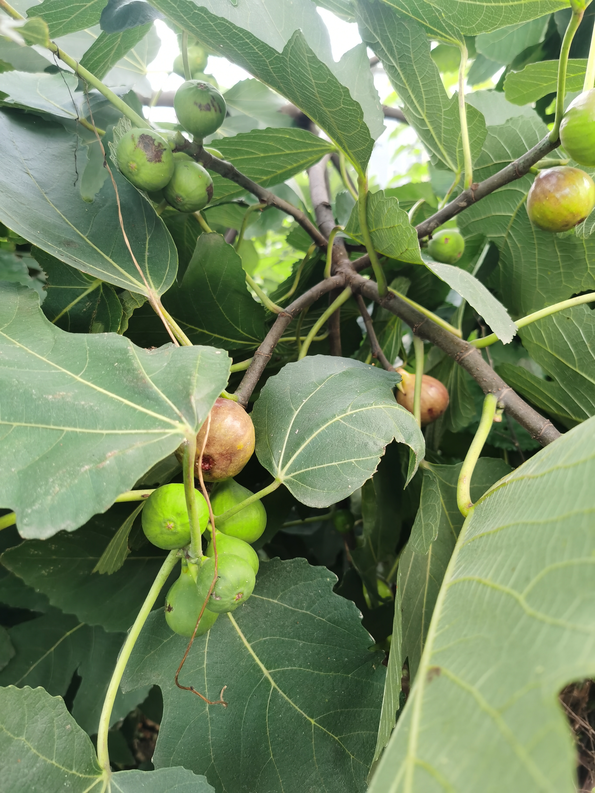
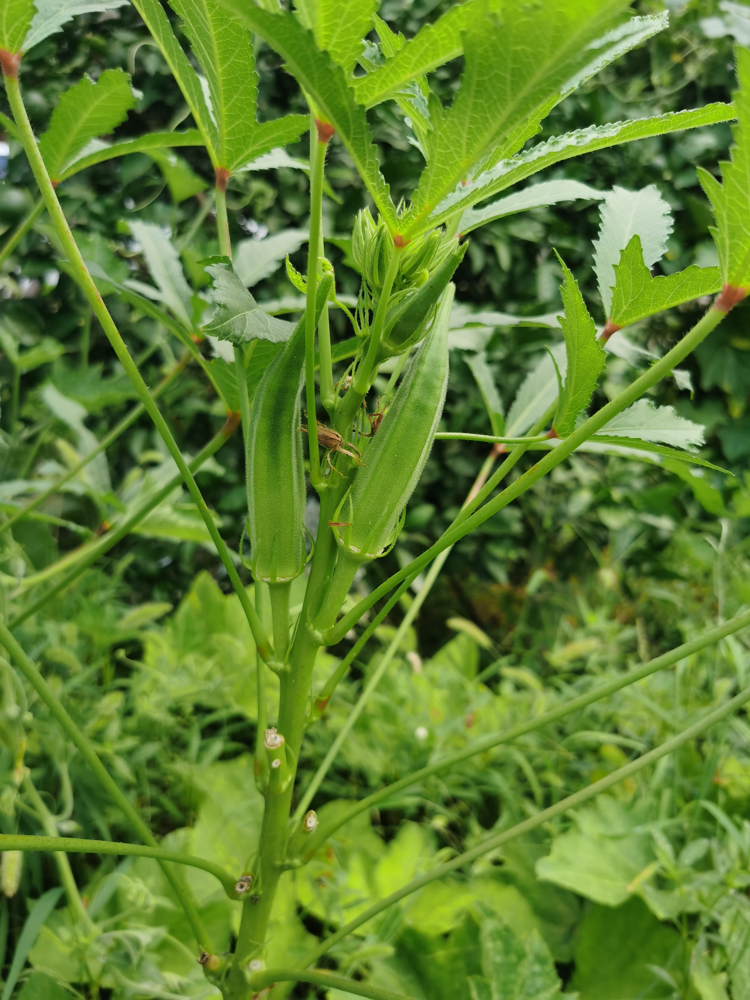
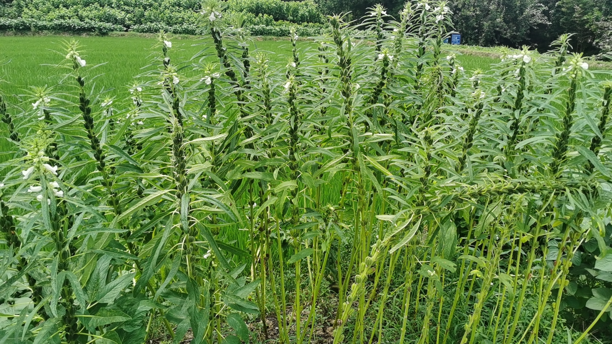
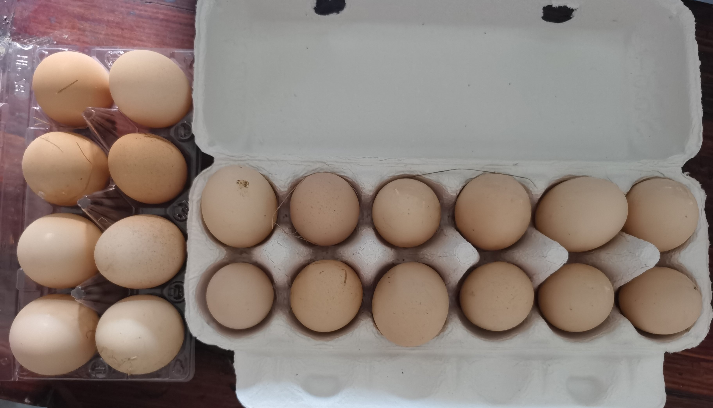

几个星期没回家，麻麻念叨着俺回家。

周五晚六点下班，拖上大学时期盖的蚕丝被和四个空的 12L 农夫山泉水桶，给姐姐做代驾回了家。
这些水桶是俺和小王日常喝的饮用水瓶，大概一周能攒下一个。
拿回家可以给奶奶用来保存黄豆、蚕豆这些需要防潮防蛀的果实。
邻居觉得这是宝贝，老爸赶紧让他带一个回去，反正俺和小王这边在源源不断地「产出」。
小时的玩伴考了教师编，再过两个星期就要去教书育人，准备买车，今天看车去了。

近来越发觉得自己的<a class="link" href="/life/birth/#我的时间观">时间观</a>里没有周期性，导致俺对于一些事情比较迟钝。
近一个多月来，观察自己朋友圈发现：

1. 大学的学弟学妹们吐槽课程作业的少了；
1. 老师朋友们去旅行的多了；
1. 平常没消息的开始晒娃了。

俺还纳闷他们这是约好一起「说走就走」吗？
这次回家才惊觉：现在是暑假！！

[一年前的暑假](../homelife)俺家里蹲，学 R、阅读、亲近大自然……
那时发现自己缺失「临在当下」的能力。
今年虽已没有了暑假，但我的技术比之前更加精进；
虽不再有大量的阅读时间，但我的思维比之前更敏锐，甚至经常发现一说就是错，应无所住而生其心。
我补全了「临在当下」的能力，不敢大言不惭说自己走到了灯火阑珊处，只是时常觉得幸福、幸运。

这周回家发现家里井口的丝瓜藤密密麻麻，形成了天然的遮阳棚，蜜蜂蝴蝶簇拥。
麻麻说藤上四个丝瓜，是她看着长大的。
今天被俺和姐姐一起摘走咯！

大伯家的无花果果实太多把树都压倒了，[随便采](../siwang)。
秋葵生长速度快，总是不小心就老了，必须常采常新。

<table>
  <tr>
    <td>
 无花果
</td>
    <td>
 秋葵
</td>
  </tr>
</table>

路旁的芝麻结了果，姐姐说小王肯定不认识，说要给小王猜。
小王猜了：哈密瓜、香瓜、冬瓜、羊角蜜。

奶奶说夏天鸡不太会生蛋，但它们最近吃得是老爸抓来的野生小鱼，营养丰富，还是会有几个土鸡蛋。
俺回家没有姐姐频繁，这次便让我把所有鸡蛋都带回杭州了。

<table>
  <tr>
    <td>
 芝麻
</td>
    <td>
 鸡蛋
</td>
  </tr>
</table>

另外还有韭菜、黄瓜、南瓜……
我和小王不常做饭，所以顺路给 YQ 送去了一些。
