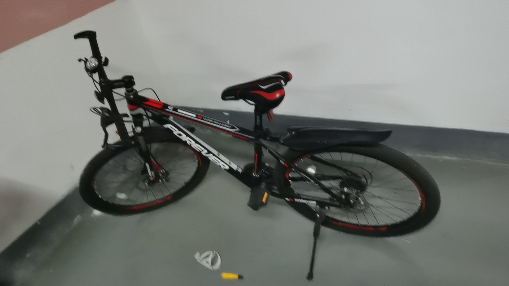

8 月 26 日，入手了俺的第一辆公路车，横穿大半个杭州城，从车店骑回家。睡前不禁想到从小到大那些骑过的自行车。全盘扫描了自己的回忆，有三辆让我印象深刻。

# 回忆中的三辆自行车

## 第一辆：姐姐的自行车

对于土生土长的农村娃，自行车是和其他小伙伴开疆拓土的重要工具，但法律规定「驾驶自行车必须年满 12 周岁」，所以 12 岁前我并没有自己的自行车，好在姐姐的自行车成了我童年时期的非专属座驾。我已记不清它的具体样子，只好根据部分回忆 + 推理尽力还原它。

首先，它是淡粉色的，我的小学同学因此嘲笑过我，但我并不在乎，因为俺可以骑着它做出他们做不出的漂移动作：加速，后刹抱死车轮，后轮拖尾后重心靠右，车把往左打，左脚落地支撑即可。

它的车架形状和小蓝（哈啰单车）差不多，不过是通过圆形钢管弯曲成形的，没有小蓝那样厚实的方形管。车篮应该也是有的，不然也太丑了吧！（参考没有车篮的共享单车）

最后，它应该有个后座，因为我记得载着姐姐尝试双放手[^1]时摔在了田里。

[^1]: 双手离开车把。

## 第二辆：初中的自行车

终于到了 12 周岁，爸爸带我去镇上买自行车，车店在镇上那条河的北侧岸边。挑好后骑回家，爸爸开着摩托车跟在我后面。

这是一辆黑色的山地车，从小学五年级到我初中毕业，载着我上下学。它通过拧车把上的变速环变档，可变速环不结实，不久后便有了裂缝。从那之后我就只骑几个档位，生怕变速环彻底裂开。

小学时，它停在教学楼北面的自行车棚里，车棚是水泥砌起来的，东西走向，约有六七十米。初中，它停在教学楼西面的塑料棚子里。

我常对自己的物品怀有很深的感情。初中时，有几个顽皮的同学经常会随机坐在棚子里的自行车上，我总提心吊胆，希望我的自行车可以幸免于难，然而并没有。当时看到有位同学坐在我的自行车上，我很难受，鼓足了勇气和他说能不能不要坐在车上，很容易倒。其实我内心是担心他压弯甚至折断自行车的脚架，导致自行车停放时倾斜的角度变大，像是年久失修的样子。结果未能如愿。

这辆自行车在我大二还是大三时被卖掉了，距我初三已七八年了，我想不起期间它经历了什么。只记得大学假期回去的时候，它靠在储物间的墙上，披着一层灰，轮胎瘪瘪的。

## 第三辆：大学的自行车

大一开学在淘宝买了这辆永久牌山地车，快递寄到菜鸟驿站，和我的好朋友一起组装。一股脑装好后才发现前叉装反了，又重新装了一次。

这辆车是有名字的！它有个车铃，上面印着「I ❤️️ my bike」，后来遇到小王的时候，❤️ 已经褪色看不见了，所以小王就叫它「I my bike」。

I my bike

它载着我在宿舍、图书馆、教学楼和我的 102 教室之间里飞奔，每晚我都会将它停到宿舍地下车库。四年多过去，我已经离开校园，它也跟着我来到现在住的地方，停在地下车库。

# 我的公路车

西溪湿地北门是骑友们休息聊天的地方，夜跑经过时热闹万分。加之自己是骑行共享单车上班，不免心生加入骑行的想法。在毕业后拜访导师时，导师提出买公路车的想法，因为他骑自己的折叠变速车上班、健身，但经常被辣堡[^2]。他也想整一个辣堡别人，于是乎便叫上健身菜鸡俺一起搞。

[^2]: 辣堡 = 拉爆。骑行黑话，吃辣堡就是骑行时被人榨干体能，当然也可以喂别人吃辣堡。

花了一个月左右的时间，请教了朋友圈里骑行的朋友，也去学校门口的捷安特体验店试骑，最终果断出手，全款拿下人生第一辆公路车。

俺的第一辆公路车

在做功课时感悟到每个领域都有学问。比如公路车车架有铝合金和碳纤维，套件有机械和电子变速，轮组也有碳轮和铝轮……和之前加入跑步群后了解到碳板跑鞋一样。

小车车[^3]，载着俺开启下一段精彩人生吧！

[^3]: 暂时还没有名字。

<!-- 碳板跑鞋，待体验一段时间分享感受之后添加超链接 -->
