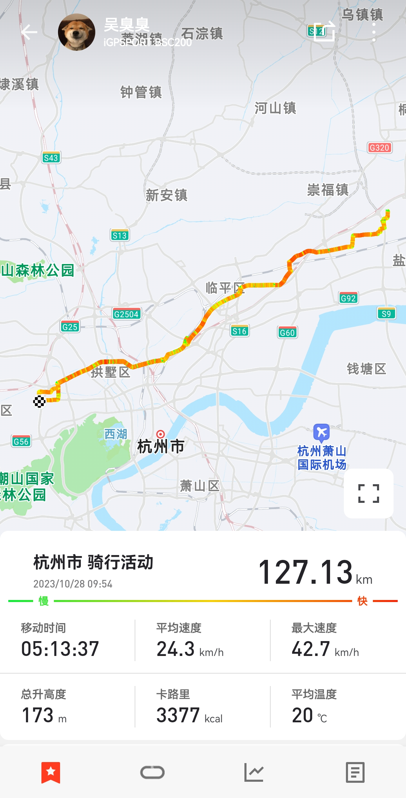

昨日周六，无心学习，9:50，想着骑快些或许能赶上回家吃午饭。[还是](../career-transition)那句话：犹豫就会败北，说走就走。

[上次回家](../national-cycle)的路线红绿灯太多，这次换了新路线。红绿灯虽少，但中途遇到断头路一条，还骑进了高铁下大型垃圾场的深处。中途预估赶不上家里饭点，无奈路边买个煎饼果子吃。后半程逆风，巡航速度起不来，勉强在 27 左右，到家已是 13:20 左右。老爸给俺煎了荷包蛋，泡了碗汤，锅里的饭还没冷，全都炫我嘴里。

午睡醒来，爸妈煮起了晚饭。奶奶回来看到我又惊又喜，得知我骑自行车回来开始念叨：骑车太累，应该坐姐姐的车回来；骑车没法带家里的地瓜给小王吃，现在家里的南瓜都给鸡吃……

吃完晚饭，老爸催我赶紧出发，不然回杭太晚。

骑行记录：

