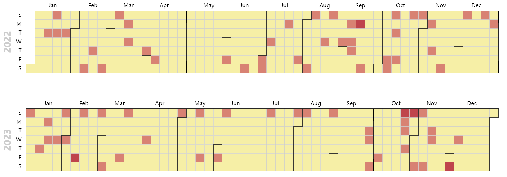

11 月看到 [httr2](https://httr2.r-lib.org/) 发布了 1.0.0 大版本，包的介绍是：

httr2 (pronounced hitter2) is a ground-up rewrite of [httr](https://httr.r-lib.org/) that provides a pipeable API with an explicit request object that solves more problems felt by packages that wrap APIs (e.g. built-in rate-limiting, retries, OAuth, secure secrets, and more).

> httr2（发音为 hitter2）是 [httr](https://httr.r-lib.org/) 从零开始的重写版本，提供了一个可使用管道的 API，并具有显式请求对象，解决了许多围绕 API 的包（例如内置速率限制、重试、OAuth、安全秘密等）所遇到的问题。

看了 Hadley 写的[介绍](https://www.tidyverse.org/blog/2023/11/httr2-1-0-0/)觉得挺好使，尤其是 [`req_perform_iterative()`](https://httr2.r-lib.org/reference/req_perform_iterative.html) 从前一个响应生成下一个请求，直到回调函数返回 `NULL` 或执行了最大请求数。在之前和 elastic 打交道的时候，翻页取数据都是用 Python 处理的，如今似乎可以用 R 更方便地完成。

现在暂时用不到这么高级的功能，于是乎拿起自己的博客试一试构建请求和处理响应。

```{r}
library(httr2)
```

# 构建请求

```{r}
req = request("https://shitao5.org/")
```

通过 `req_dry_run()` 查看 httr2 将要发送给服务器的请求内容，但实际上并不会真的发送请求。

```{r}
req %>% req_dry_run()
```

我的目标是把[博客日志页](https://shitao5.org/posts/)上的内容摘下来，所以需要构建对日志页的请求：

```{r}
req_posts = req %>% req_url_path("/posts")
req_posts %>% req_dry_run()
```

# 发送请求，获取响应

`req_perform()` 即可：

```{r}
resp = req_posts %>% req_perform()
```

# 查看请求内容

## 查看原始响应

`resp_raw()` 用于查看从服务器接收到的响应：

```{r eval=FALSE}
# 内容过多不展示
resp %>% resp_raw()
```

## 提取响应中的信息

### 提取响应中 body 部分

```{r}
resp_body = resp %>% resp_body_html()
resp_body
```

### 获取博客日期

这时候该操起 [rvest](https://rvest.tidyverse.org/) 了。

```{r}
library(rvest)
```

```{r}
dates = resp_body %>% 
  html_elements("li") %>% 
  html_element("span") %>% 
  html_text()

dates %>% head()
```

### 获取博客标题

```{r}
titles = resp_body %>% 
  html_elements("li") %>% 
  html_element("a") %>% 
  html_text()

titles %>% head()
```

### 获取博客链接

```{r}
links = resp_body %>% 
  html_elements("li") %>% 
  html_elements("a") %>% 
  html_attr("href") %>% 
  paste0("https://shitao5.org", .)  # 拼上首页网址

links %>% head()
```

## 汇总提取信息

```{r message=FALSE}
library(tidyverse)

blog_posts = tibble(
  title = titles,
  date = ymd(dates),
  link = links
)

# 去除 link 列，既方便输出，又可以隐藏俺乱写 slug 的真相😊
blog_posts %>% select(-link)
```

# 博客更新分析

## 每天更新数量

```{r}
day_n = blog_posts %>% count(date)
day_n %>% arrange(desc(date))
```

## 2022-2023 年更新情况

分析 2022 和 2023 年每天的发文情况：

```{r}
year_dates = seq.Date(as.Date("2022-01-01"), as.Date("2023-12-31"), by = "day")
year_day = tibble(date = ymd(year_dates)) %>% 
  left_join(day_n, join_by(date)) %>% 
  replace_na(list(n = 0))
```


```{r eval=FALSE, fig.retina=3}
library(echarts4r)

year_day %>% 
  mutate(year = year(date)) %>% 
  group_by(year) %>% 
  e_charts(date) %>% 
  e_calendar(range = "2022", top = "40") %>% 
  e_calendar(range = "2023", top = "260") %>% 
  e_heatmap(n, coord_system = "calendar") %>% 
  e_visual_map(max = max(year_day$n))
```

<div class='fullwidth'>

</div>

果然还是周末写得多。
