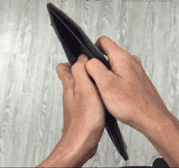

结论：小米手机可以给华为 GT4 手表反向充电，但需要充几分钟就调整下手表位置，否则手机会自动关闭反向充电。

---

自己带的华为 GT4 手表，日常续航大约两星期左右。充电器在公司，平常发现电量快不足便摘下充满电。元旦已离开公司，突然想起来好久没充电了，一看还剩 5%。

第一反应想到两个方法：

1. 钞能力：买一个充电器闪送到家。
2. 碰运气：小王的苹果手表充电器看看能不能充。后面尝试了，不行。

小红书搜了一下，广大网友有神通，说手机反向充电就可以，试了下果然行，充电速度还不赖。

这倒是个好事情，我琢磨着忘记给手表充电也不是小概率事件，这样免费、便利的解决方案是最优解。
