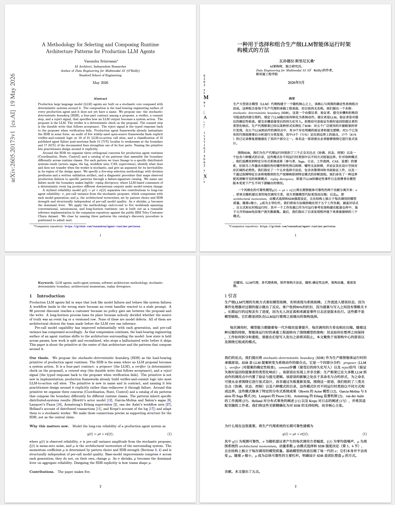

AI 发展日新月异，想知道前沿研究发展到什么地步，看看论文或许是最直接的方式。

今天物色了一些论文，才发现当前的工具链对文献管理没有太好的支持。于是，我把以前最喜欢的文献管理软件 Zotero 请回来了。

大学时候读论文，用 Zotero 管理文献，当时还是 Zotero 5，快毕业的时候有了 Zotero 6。今天在官网再次相遇，居然已经到 Zotero 9 了，士别三日当刮目相待啊！

遥想当年，我发现这玩意儿配上茉莉花等插件简直是效率神器，因此专门录制了视频发在 B站，后来居然有七八万的播放量。现在想想，俺也是短暂当过知识区小 up 主的人哈哈。

如今再用 Zotero，已没有精力再折腾那些插件。安装好后，简单调整下原生的设置，并通过坚果云同步，文献管理工具就算是配齐了。

文献管理有了，还缺顺手的 PDF 翻译工具。好在前几天探索到了 [PDFMathTranslate](https://github.com/PDFMathTranslate/PDFMathTranslate)，它可以使用本地 ollama 部署模型进行翻译，也可以接入 deepseek 等模型服务商的 API。

我测试了一下，本地 ollama 太慢，主要是没用显卡。最后还是价格屠夫 deepseek 的 deepseek-v4-flash 模型更吸引我。翻译六篇英文论文，共计206页，花费 1.31 元，非常能接受。

这个工具的好处是能尽量保持原文排版、公式等内容，并生成双语对照 PDF（也可以纯中文版），很符合我的阅读习惯。翻译效果如下：

如果想要打印文献阅读，英文版选择打印奇数页，中文版选择打印偶数页。

看起论文，就想起大学时光，很纯粹地静心学习，也终小有所获。如今再次看起论文，主题虽有所不同，但自我成长的目标仍是一致的。

看来工作三年，归来仍是学生。

