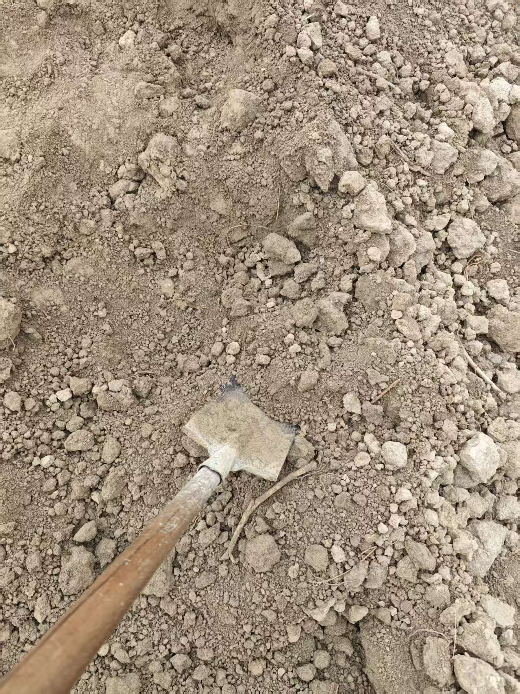
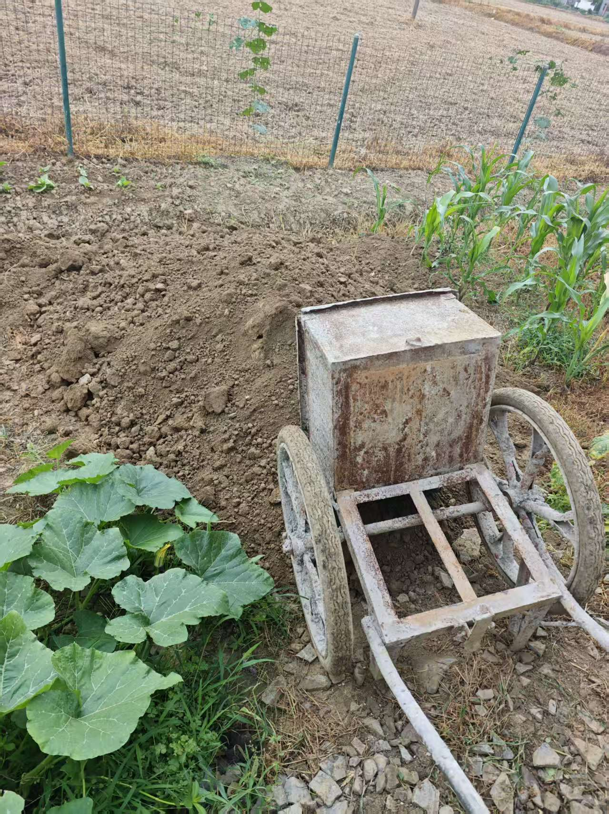

自从老爸种起了菜，家边上的几片小土地就被规划得明明白白。其中西边那块菜地因为地势低，下雨后经常积水，收成一直不好。如何把这片土地真正利用起来，成了老爸苦思冥想的问题。

最近，村里规划把家门前的水泥路要加宽，并升级成柏油路。不远处又有一片桑树地要改成田地，需要整体向下挖半米，因此多出不少肥沃的泥土。老爸便以每车 50 元的价格，请施工队拉来了 5 车泥，卸在菜地的一头。

我从[监控](../home-camera/)里看到，老爸老妈和奶奶三人，用铁铲和小翻斗车，一点点把这堆泥往菜地里铺开。这么繁重的活，我肯定得出点力。

今早去医院检查牙齿，根管带牙冠一年后复查，在医生的建议下洗了牙。结束后，开小白回家，给爸妈来一个闪现的惊喜。

午睡醒来，外面仍下着小雨。爸妈做煎饼吃，我顺手展现颠锅手艺，给煎饼翻了面，也算给爸妈露一手。吃完煎饼，雨正好停了。我提议要去翻泥，平时在办公室坐太久了，需要动一动。

这次我做主力，把泥铲进翻斗车里，老妈辅助，老爸负责把翻斗车推到目的地，卸完再回来装泥。老妈强烈建议我穿球鞋、戴手套，我坚持穿拖鞋舒服、戴手套使不上劲，按照我自己的方式来。

其实我知道，不戴手套用铁铲，手容易起茧，甚至起水泡。但是戴手套容易滑，需要用更大的力气去握住铁铲。很多事情都是权衡后的结果，比如有人为了电脑不进灰选择用键盘膜，代价是散热和打字手感不佳。我喜欢最直接地提高做事效率，[工具为做事服务](../tools-serve-me/)。因此我不用键盘膜，也不戴手套耍铁铲。说手也是工具，听起来有点物化的嫌疑，但确实是这么个理。

就这样，装泥、运输、卸泥、返回继续装泥，不知道重复了多少个循环，只知道持续了两小时。不用装泥的时候，我就徒手把大块泥土搬到最近的菜地边；稍微小快些的，直接投掷过去。老妈说有我做主力，轻松多了，哈哈。

最后老爸喊停，说干到现在这个程度差不多了。收工后，我用井水洗手洗脚洗拖鞋。双手起了一点小茧，右手中指下边有一个不明显的小水泡，比我想象中好一些。

我对比了开工前和收工后的土堆高度，发现差别并不明显，不禁感叹现代工具的强大。我们三人干两小时的工作量，用挖掘机说不定两三斗就能搞定。作为坐在办公室里的上班族，这两个小时让我出不少汗，收工后坐下来，身体的疲惫感马上就上来了。

很早以前我就想过，健身房里健身的人，为什么不把让几十公斤杠铃上下移动、最终位移为零的活动，转化为一些有实际收益的活动呢，比如干农活。跑步机上用电原地奔跑的人，为什么不蹬一辆可以发电并存能的自行车呢？

答案我大部分都能想到：增肌、塑型、减肥……也包含某种身份的体现：看，我可以把时间和力气用在没有直接产出的地方。

相比之下，我的目的性更强一些，我希望我的注意力、时间和力气，尽可能投入到有产出的地方。涉及体力投入时，我喜欢户外运动，运动的同时可以看风景，呼吸新鲜空气；也喜欢打扫卫生、干农活，身体动起来的同时，生活也更具体了。

疲惫感袭来，今晚睡个好觉。
