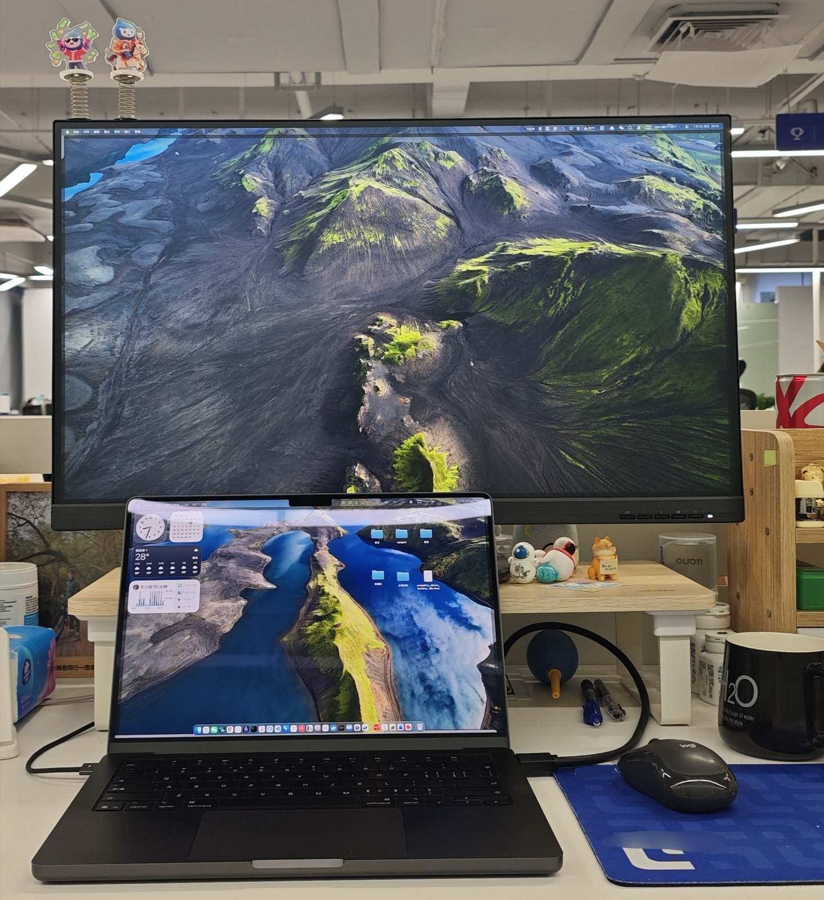
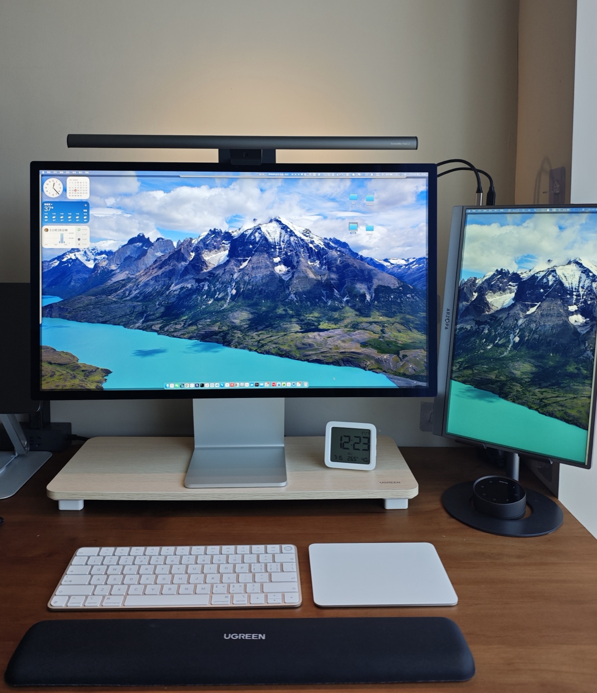

最近在家办公，我总觉得哪里不舒服，折腾一圈才发现，问题竟然出在显示器高度上。

我习惯了公司工位 11.8 cm 的增高架 + 4.5 cm 的显示器底座高。而家里的 Display 的固定支架，高度 11.6 cm，再加上和公司同款的 11.8 cm 增高架，比我的习惯高了七公分。这导致我在家办公总不经意地昂着头。

今天把增高架的脚拆了，回归习惯，舒服多了。

身体真的比自己早有感觉。

<table>
  <tr>
    <td>
 工位
</td>
    <td>
 在家
</td>
  </tr>
</table>
